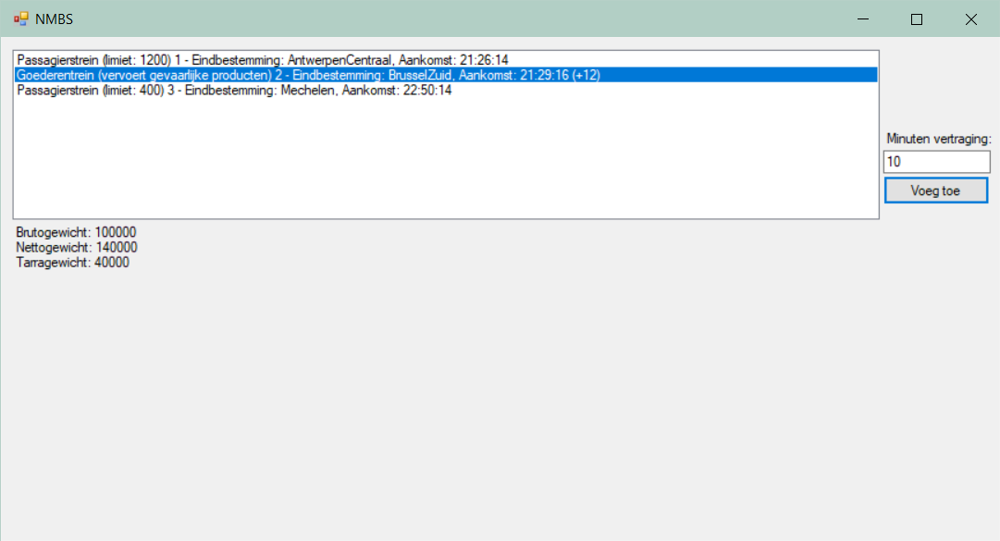

# Les 2

## Oefening 1


### Klasse Form1

```csharp
public partial class Form1 : Form
{
    List<Trein> treinen;
    public Form1()
    {
        InitializeComponent();
        treinen = new List<Trein>
        {
            new Trein(1, Eindbestemmingen.AntwerpenCentraal, new DateTime(2019, 4, 9, 21, 26, 14)),
            new Trein(2, Eindbestemmingen.BrusselZuid, new DateTime(2019, 4, 9, 21, 29, 16)),
            new Trein(3, Eindbestemmingen.Mechelen, new DateTime(2019, 4, 9, 22, 50, 14))
        };
        listBoxTreinen.DataSource = treinen;
    }

    private void ButtonVertragingToevoegen_Click(object sender, EventArgs e)
    {
        Trein geselecteerdeTrein = (Trein)listBoxTreinen.SelectedItem;
        geselecteerdeTrein.Vertraging += int.Parse(textBoxVertraging.Text);
        MessageBox.Show($"De aankomst in {geselecteerdeTrein.Eindbestemming} van trein {geselecteerdeTrein.Nummer} was gepland om {geselecteerdeTrein.Aankomst.ToLongTimeString()} en wordt verwacht om {geselecteerdeTrein.Aankomst.AddMinutes(geselecteerdeTrein.Vertraging).ToLongTimeString()}. Er is momenteel een totale vertraging van {geselecteerdeTrein.Vertraging} minuten.", "Vertraging toegevoegd", MessageBoxButtons.OK, MessageBoxIcon.Information);
        listBoxTreinen.DataSource = null;
        listBoxTreinen.DataSource = treinen;
    }
}
```

### Klasse Trein

```csharp
enum Eindbestemmingen { BrusselZuid, AntwerpenCentraal, Mechelen}
    class Trein
    {
        public int Nummer { get; }
        public Eindbestemmingen Eindbestemming { get; }
        public DateTime Aankomst { get; }
        public int Vertraging { get; set; }

        public Trein(int nummer, Eindbestemmingen eindbestemming, DateTime aankomst)
        {
            Nummer = nummer;
            Eindbestemming = eindbestemming;
            Aankomst = aankomst;
        }

        public override string ToString()
        {
            StringBuilder result = new StringBuilder();
            result.Append($"{Nummer} - Eindbestemming: {Eindbestemming}, Aankomst: {Aankomst.ToLongTimeString()}");
            if (Vertraging > 0)
                result.Append($" (+{Vertraging:00})");
            return result.ToString();
        }
    }
```

## Oefening 2



### Klasse Form1

```csharp
public partial class Form1 : Form
{
    List<Trein> treinen;
    public Form1()
    {
        InitializeComponent();
        treinen = new List<Trein>
        {
            new Passagierstrein(1, Eindbestemmingen.AntwerpenCentraal, new DateTime(2019, 4, 9, 21, 26, 14), 1200),
            new Goederentrein(2, Eindbestemmingen.BrusselZuid, new DateTime(2019, 4, 9, 21, 29, 16), 100000, 140000, true),
            new Passagierstrein(3, Eindbestemmingen.Mechelen, new DateTime(2019, 4, 9, 22, 50, 14), 400)
        };
        listBoxTreinen.DataSource = treinen;
    }

    private void ButtonVertragingToevoegen_Click(object sender, EventArgs e)
    {
        Trein geselecteerdeTrein = (Trein)listBoxTreinen.SelectedItem;
        geselecteerdeTrein.VoegVertragingToe(int.Parse(textBoxVertraging.Text));
        MessageBox.Show($"De aankomst in {geselecteerdeTrein.Eindbestemming} van trein {geselecteerdeTrein.Nummer} was gepland om {geselecteerdeTrein.Aankomst.ToLongTimeString()} en wordt verwacht om {geselecteerdeTrein.Aankomst.AddMinutes(geselecteerdeTrein.Vertraging).ToLongTimeString()}. Er is momenteel een totale vertraging van {geselecteerdeTrein.Vertraging} minuten.", "Vertraging toegevoegd", MessageBoxButtons.OK, MessageBoxIcon.Information);
        listBoxTreinen.DataSource = null;
        listBoxTreinen.DataSource = treinen;
    }

    private void ListBoxTreinen_SelectedIndexChanged(object sender, EventArgs e)
    {
        if (listBoxTreinen.SelectedItem is Goederentrein trein) //Het alternatief 'listBoxTreinen.SelectedItem.GetType() == typeof(Goederentrein)' zorgt er hier voor dat de datasource niet opnieuw kan worden ingesteld (om de vertragingen weer te geven), zelf heb ik geen idee waarom.
        { //Nog een voordeel aan het 'is'-keyword is dat je meteen een referentie kan aanmaken, wat de gecommente code op het lijntje hieronder overbodig maakt.
            //Goederentrein trein = (Goederentrein)listBoxTreinen.SelectedItem;
            labelInfoGoederenTrein.Text = $"Brutogewicht: {trein.BrutoGewicht}\nNettogewicht: {trein.NettoGewicht}\nTarragewicht: {trein.BerekenTarraGewicht()}";
        }
        else
            labelInfoGoederenTrein.ResetText();
    }
}
```

### Klasse Trein

```csharp
enum Eindbestemmingen { BrusselZuid, AntwerpenCentraal, Mechelen}
class Trein
{
    public int Nummer { get; }
    public Eindbestemmingen Eindbestemming { get; }
    public DateTime Aankomst { get; }
    public double Vertraging { get; private set; }

    public Trein(int nummer, Eindbestemmingen eindbestemming, DateTime aankomst)
    {
        Nummer = nummer;
        Eindbestemming = eindbestemming;
        Aankomst = aankomst;
    }

    public virtual void VoegVertragingToe(double minuten)
    {
        Vertraging += minuten;
    }

    public override string ToString()
    {
        StringBuilder result = new StringBuilder();
        result.Append($"{Nummer} - Eindbestemming: {Eindbestemming}, Aankomst: {Aankomst.ToLongTimeString()}");
        if (Vertraging > 0)
            result.Append($" (+{Vertraging:00})");
        return result.ToString();
    }
}
```

### Klasse Passagierstrein

```csharp
class Passagierstrein : Trein
{
    public int PassagiersCapaciteit { get; }
    public Passagierstrein(int nummer, Eindbestemmingen eindbestemming, DateTime aankomst, int passagiersCapaciteit) : base(nummer, eindbestemming, aankomst)
    {
        PassagiersCapaciteit = passagiersCapaciteit;
    }

    public override string ToString()
    {
        return $"Passagierstrein (limiet: {PassagiersCapaciteit}) " + base.ToString();
    }
}
```

### Klasse Goederentrein

```csharp
class Goederentrein : Trein
{
    public int BrutoGewicht { get; set; }
    public int NettoGewicht { get; set; }
    public bool VervoertGevaarlijkeProducten { get; set; }
    public Goederentrein(int nummer, Eindbestemmingen eindbestemming, DateTime aankomst, int brutoGewicht, int nettoGewicht, bool vervoertGevaarlijkeProducten) : base(nummer, eindbestemming, aankomst)
    {
        BrutoGewicht = brutoGewicht;
        NettoGewicht = nettoGewicht;
        VervoertGevaarlijkeProducten = vervoertGevaarlijkeProducten;
    }

    public override void VoegVertragingToe(double minuten)
    {
        if (VervoertGevaarlijkeProducten)
            base.VoegVertragingToe(minuten * 1.2);
        else //moet omdat we niets returnen --> de methode wordt dus niet beëindigd op het vorige lijntje. Indien we geen else zouden zetten, zou de vertraging twee keer worden toegevoegd.
            base.VoegVertragingToe(minuten);
    }

    public int BerekenTarraGewicht()
    {
        return NettoGewicht - BrutoGewicht;
    }

    public override string ToString()
    {
        string vervoertGevaarlijkeProducten = VervoertGevaarlijkeProducten ? "(vervoert gevaarlijke producten)" : "(vervoert geen gevaarlijke producten)";
        //Conditional variable, meer info hier: https://docs.microsoft.com/en-us/dotnet/csharp/language-reference/operators/conditional-operator

        return $"Goederentrein {vervoertGevaarlijkeProducten} " + base.ToString();
    }
}
```

## Oefening 3


### Klasse Form1

```csharp
public partial class Form1 : Form
    {
        List<Trein> treinen;
        List<Passagier> passagiers;
        public Form1()
        {
            InitializeComponent();
            treinen = new List<Trein>
            {
                new Passagierstrein(1, Eindbestemmingen.AntwerpenCentraal, new DateTime(2019, 4, 9, 21, 26, 14), 1200),
                new Goederentrein(2, Eindbestemmingen.BrusselZuid, new DateTime(2019, 4, 9, 21, 29, 16), 100000, 140000, true),
                new Passagierstrein(3, Eindbestemmingen.Mechelen, new DateTime(2019, 4, 9, 22, 50, 14), 400)
            };
            passagiers = new List<Passagier>
            {
                new EersteKlassePassagier("Tabatabaie", "Dana", new Adres("Ellermanstraat", "33", "2000", "Antwerpen"), "230205024040410841820"),
                new TweedeKlassePassagier("Janssens", "Maxim", new Adres("Lange Nieuwstraat", "101", "2000", "Antwerpen"), "3882323297923572928981")
            };

            listBoxTreinen.DataSource = treinen;
        }

        private void ButtonVertragingToevoegen_Click(object sender, EventArgs e)
        {
            Trein geselecteerdeTrein = (Trein)listBoxTreinen.SelectedItem;
            geselecteerdeTrein.VoegVertragingToe(int.Parse(textBoxVertraging.Text));
            MessageBox.Show($"De aankomst in {geselecteerdeTrein.Eindbestemming} van trein {geselecteerdeTrein.Nummer} was gepland om {geselecteerdeTrein.Aankomst.ToLongTimeString()} en wordt verwacht om {geselecteerdeTrein.Aankomst.AddMinutes(geselecteerdeTrein.Vertraging).ToLongTimeString()}. Er is momenteel een totale vertraging van {geselecteerdeTrein.Vertraging} minuten.", "Vertraging toegevoegd", MessageBoxButtons.OK, MessageBoxIcon.Information);
            listBoxTreinen.DataSource = null;
            listBoxTreinen.DataSource = treinen;
        }

        private void ListBoxTreinen_SelectedIndexChanged(object sender, EventArgs e)
        {
            if (listBoxTreinen.SelectedItem is Goederentrein trein)
                labelInfoGoederenTrein.Text = $"Brutogewicht: {trein.BrutoGewicht}\nNettogewicht: {trein.NettoGewicht}\nTarragewicht: {trein.BerekenTarraGewicht()}";
            else
                labelInfoGoederenTrein.ResetText();
        }

        private void TextBoxPassagierOpzoeken_KeyUp(object sender, KeyEventArgs e)
        {
            if(e.KeyCode == Keys.Enter)
            {
                string result = "Geen passagier met opgegeven rijksregisternummer gevonden.";
                foreach(Passagier passagier in passagiers)
                {
                    if (passagier.Rijksregisternummer == textBoxZoekPassagier.Text)
                        result = $"De passagier {passagier.Voornaam} {passagier.Naam} heeft de volgende privileges: {passagier.Privileges()}";
                }
                MessageBox.Show(result);
            }
        }
    }
```

### Klasse Adres

```csharp
class Adres
{
    public string Straat { get; set; }
    public string Huisnummer { get; set; }
    public string Postcode { get; set; }
    public string Gemeente { get; set; }

    public Adres(string straat, string huisnummer, string postcode, string gemeente)
    {
        Straat = straat;
        Huisnummer = huisnummer;
        Postcode = postcode;
        Gemeente = gemeente;
    }

    public override string ToString() => $"{Straat} {Huisnummer}\n{Postcode} {Gemeente}";
}
```

### Klasse Passagier

```csharp
class Passagier
{
    public string Naam { get; set; }
    public string Voornaam { get; set; }
    public Adres Adres { get; set; }
    public string Rijksregisternummer { get; set; }

    public Passagier(string naam, string voornaam, Adres adres, string rijksregisternummer)
    {
        Naam = naam;
        Voornaam = voornaam;
        Adres = adres;
        Rijksregisternummer = rijksregisternummer;
    }

    public virtual string Privileges() => "Geen extra privileges";

    public override string ToString() => $"{Voornaam} {Naam}\n\n{Adres}";
}
```

### Klasse EersteKlassePassagier

```csharp
class EersteKlassePassagier : Passagier
{
    public EersteKlassePassagier(string naam, string voornaam, Adres adres, string rijksregisternummer) : base(naam, voornaam, adres, rijksregisternummer)
    {
    }

    public override string Privileges() => $"Stille ruimte, plaats voor een laptop en aansluiting op het elektriciteitsnet.";

    public override string ToString() => "(1) " + base.ToString();
}
```

### Klasse TweedeKlassePassagier

```csharp
class TweedeKlassePassagier : Passagier
{
    public TweedeKlassePassagier(string naam, string voornaam, Adres adres, string rijksregisternummer) : base(naam, voornaam, adres, rijksregisternummer)
    {
    }

    public override string ToString() => "(2) " + base.ToString();
}
```

### Klasse Trein, Passagierstrein en Goederentrein

Blijven hetzelfde als in oefening 2.

## Oefening 4

### Klasse Form1

```csharp
public partial class Form1 : Form
{
    List<Trein> treinen;
    List<Passagier> passagiers;
    public Form1()
    {
        InitializeComponent();
        treinen = new List<Trein>
        {
            new Passagierstrein(1, Eindbestemmingen.AntwerpenCentraal, new DateTime(2019, 4, 9, 21, 26, 14), 1200),
            new Goederentrein(2, Eindbestemmingen.BrusselZuid, new DateTime(2019, 4, 9, 21, 29, 16), 100000, 140000, true),
            new Passagierstrein(3, Eindbestemmingen.Mechelen, new DateTime(2019, 4, 9, 22, 50, 14), 400)
        };
        passagiers = new List<Passagier>
        {
            new EersteKlassePassagier("Tabatabaie", "Dana", new Adres("Ellermanstraat", "33", "2000", "Antwerpen"), new DateTime(2000, 8, 24), Geslachten.Man, "230.2050.240--418.20"),//fout rijksregisternummer, zal door property worden veranderd naar 00.00.00-000.00
            new TweedeKlassePassagier("Janssens", "Maxim", new Adres("Lange Nieuwstraat", "101", "2000", "Antwerpen"), new DateTime(2000, 8, 24), Geslachten.Man, "00.08.24-125.16"),
            new TweedeKlassePassagier("De Peuter", "Kobe", new Adres("Ellermanstraat", "33", "2000", "Antwerpen"), new DateTime(1999, 8, 4), Geslachten.Man, "B"),//Geeft bisnummer 99.48.04-001.34
            new TweedeKlassePassagier("Szapinszky", "Yanu", new Adres("Ellermanstraat", "33", "2000", "Antwerpen"), new DateTime(1999, 8, 4), Geslachten.Man, "B"),//Geeft bisnummer 99.48.04-003.36
            new TweedeKlassePassagier("Withaegels", "Justin", new Adres("Ellermanstraat", "33", "2000", "Antwerpen"), new DateTime(1999, 8, 4), Geslachten.Man, "B"),//Geeft bisnummer 99.48.04-005.38
            new TweedeKlassePassagier("Fz", "Yalda", new Adres("Ellermanstraat", "33", "2000", "Antwerpen"), new DateTime(1999, 8, 4), Geslachten.Vrouw, "B"),//Geeft bisnummer 99.48.04-002.35
            new TweedeKlassePassagier("Deron", "Evelien", new Adres("Ellermanstraat", "33", "2000", "Antwerpen"), new DateTime(1999, 8, 4), Geslachten.Vrouw, "B")//Geeft bisnummer 99.48.04-004.37
        };

        listBoxTreinen.DataSource = treinen;
    }

    private void ButtonVertragingToevoegen_Click(object sender, EventArgs e)
    {
        Trein geselecteerdeTrein = (Trein)listBoxTreinen.SelectedItem;
        geselecteerdeTrein.VoegVertragingToe(int.Parse(textBoxVertraging.Text));
        MessageBox.Show($"De aankomst in {geselecteerdeTrein.Eindbestemming} van trein {geselecteerdeTrein.Nummer} was gepland om {geselecteerdeTrein.Aankomst.ToLongTimeString()} en wordt verwacht om {geselecteerdeTrein.Aankomst.AddMinutes(geselecteerdeTrein.Vertraging).ToLongTimeString()}. Er is momenteel een totale vertraging van {geselecteerdeTrein.Vertraging} minuten.", "Vertraging toegevoegd", MessageBoxButtons.OK, MessageBoxIcon.Information);
        listBoxTreinen.DataSource = null;
        listBoxTreinen.DataSource = treinen;
    }

    private void ListBoxTreinen_SelectedIndexChanged(object sender, EventArgs e)
    {
        if (listBoxTreinen.SelectedItem is Goederentrein trein)
            labelInfoGoederenTrein.Text = $"Brutogewicht: {trein.BrutoGewicht}\nNettogewicht: {trein.NettoGewicht}\nTarragewicht: {trein.BerekenTarraGewicht()}";
        else
            labelInfoGoederenTrein.ResetText();
    }

    private void TextBoxPassagierOpzoeken_KeyUp(object sender, KeyEventArgs e)
    {
        if(e.KeyCode == Keys.Enter)
        {
            string result = "Geen passagier met opgegeven rijksregisternummer gevonden.";
            foreach(Passagier passagier in passagiers)
            {
                if (passagier.Rijksregisternummer == textBoxZoekPassagier.Text)
                    result = $"De passagier {passagier.Voornaam} {passagier.Naam} heeft de volgende privileges: {passagier.Privileges()}";
            }
            MessageBox.Show(result);
        }
    }
}
```

### Klasse Passagier

```csharp
enum Geslachten { Man, Vrouw, Onbekend}
class Passagier
{
    public string Naam { get; set; }
    public string Voornaam { get; set; }
    public Adres Adres { get; set; }
    public DateTime Geboortedatum { get; set; }
    public Geslachten Geslacht { get; set; }
    private string rijksregisternummer;

    public string Rijksregisternummer
    {
        get { return rijksregisternummer; }
        set { rijksregisternummer = VerifieerRijksRegisterNummer.Verwerk(value, Geslacht, Geboortedatum); }
    }


    public Passagier(string naam, string voornaam, Adres adres, DateTime geboorteDatum, Geslachten geslacht, string rijksregisternummer)
    {
        Naam = naam;
        Voornaam = voornaam;
        Adres = adres;
        Geboortedatum = geboorteDatum;
        Geslacht = geslacht;
        Rijksregisternummer = rijksregisternummer;
    }

    public virtual string Privileges() => "Geen extra privileges";

    public override string ToString() => $"{Voornaam} {Naam}\n\n{Adres}";
}
```

### Klasse VerifieerRijksRegisterNummer

```csharp
static class VerifieerRijksRegisterNummer
    {
        static readonly Dictionary<DateTime, int> bisMan = new Dictionary<DateTime, int>();
        static readonly Dictionary<DateTime, int> bisVrouw = new Dictionary<DateTime, int>();

        public static string Verwerk(string input, Geslachten geslacht, DateTime geboortedatum)
        {
            string output;
            if (input == "B")
            {
                StringBuilder stringBuilder = new StringBuilder();
                if (geslacht == Geslachten.Man && bisMan.TryGetValue(geboortedatum, out int dagteller))
                {
                    dagteller += 2;
                    bisMan[geboortedatum] = dagteller;
                }
                else if ((geslacht == Geslachten.Vrouw || geslacht == Geslachten.Onbekend) && bisVrouw.TryGetValue(geboortedatum, out dagteller))
                {
                    dagteller += 2;
                    bisVrouw[geboortedatum] = dagteller;
                }
                else if (geslacht == Geslachten.Man)
                {
                    dagteller = 1;
                    bisMan.Add(geboortedatum, dagteller);
                }
                else
                {
                    dagteller = 2;
                    bisVrouw.Add(geboortedatum, dagteller);
                }
                int maandExtra = geslacht == Geslachten.Onbekend ? 20 : 40;
                stringBuilder.Append($"{geboortedatum.Year.ToString().Substring(2)}.{geboortedatum.Month + maandExtra}.{geboortedatum.Day.ToString("00")}-{dagteller.ToString("000")}.{(geboortedatum.Year >= 2000 ? ((2 + int.Parse(geboortedatum.Year.ToString().Substring(2) + (geboortedatum.Month + maandExtra).ToString() + geboortedatum.Day.ToString("00") + dagteller.ToString("000"))) % 97).ToString("00") : (int.Parse(geboortedatum.Year.ToString().Substring(2) + (geboortedatum.Month + maandExtra).ToString() + geboortedatum.Day.ToString("00") + dagteller.ToString("000")) % 97).ToString("00"))}");
                output = stringBuilder.ToString();
            }
            else if (Regex.IsMatch(input, @"^\d{2}\.(0[0-9]|1[0-2])\.(0[0-9]|1[0-9]|2[0-9]|3[0-1])[-](99[0-8]|[0-9][0-8][0-9]|[0-8][0-9][0-9])\.\d{2}$"))
            {
                string zonderScheidingsTekens = $"{(geboortedatum.Year >= 2000 ? "2" : "")}{input.Replace(".", "").Replace("-", "").Substring(0, 9)}";
                int outputGetal = int.Parse(zonderScheidingsTekens);
                if (97 - outputGetal % 97 == int.Parse(input.Substring(13, 2)))
                    output = input;
                else
                    output = "00.00.00-000.00";
            }
            else
                output = "00.00.00-000.00";
            return output;
        }
    }
```

### Klasse EersteKlassePassagier

```csharp
class EersteKlassePassagier : Passagier
{
    public EersteKlassePassagier(string naam, string voornaam, Adres adres, DateTime geboorteDatum, Geslachten geslacht, string rijksregisternummer) : base(naam, voornaam, adres, geboorteDatum, geslacht, rijksregisternummer)
    {
    }

    public override string Privileges() => $"Stille ruimte, plaats voor een laptop en aansluiting op het elektriciteitsnet.";

    public override string ToString() => "(1) " + base.ToString();
}
```

### Klasse TweedeKlassePassagier

```csharp
class TweedeKlassePassagier : Passagier
{
    public TweedeKlassePassagier(string naam, string voornaam, Adres adres, DateTime geboorteDatum, Geslachten geslacht, string rijksregisternummer) : base(naam, voornaam, adres, geboorteDatum, geslacht, rijksregisternummer)
    {
    }

    public override string ToString() => "(2) " + base.ToString();
}
```

### Klasse Adres

Blijft hetzelfde als in oefening 3.

### Klasse Trein, Passagierstrein en Goederentrein

Blijven hetzelfde als in oefening 2.
