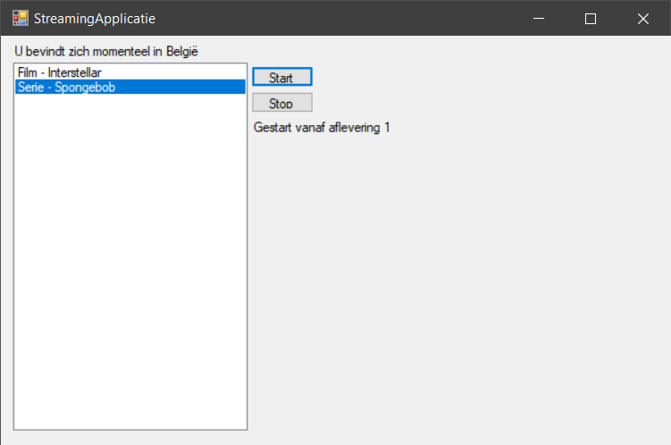

# Les 3

## Oefening 1

Gewoon de klasse 'Stof' abstract maken door het `abstract`-keyword ervoor te zetten. `abstract class Stof`
De rest van de klasse blijft hetzelfde.

Hetzelfde voor oefening 5.4 van module 3. `internal abstract class Wagen`

## Oefening 2



### Abstracte klasse Medium

```csharp
abstract class Medium
{
    public string Naam { get; set; }
    public string Regisseur { get; set; }
    public List<Acteur> Acteurs { get; set; }

    public abstract string Afspelen();
    public abstract string Stoppen();
}
```

### Klasse Film

```csharp
class Film : Medium
{
      public Film(string naam, string regisseur, List<Acteur> acteurs)
      {
          Naam = naam;
          Regisseur = regisseur;
          Acteurs = acteurs;
      }

      public override string Afspelen()
      {
          return "Gestart vanaf het begin.";
      }

      public override string Stoppen()
      {
          return "Gestopt met spelen.";
      }

      public override string ToString() => $"Film - {Naam}";
}
```

### Klasse Serie

```csharp
class Serie : Medium
{
      public int AantalAfleveringen { get; set; }
      public int HuidigeAflevering { get; set; }

      public Serie(string naam, string regisseur, int aantalAfleveringen, List<Acteur> acteurs)
      {
          Naam = naam;
          Regisseur = regisseur;
          AantalAfleveringen = aantalAfleveringen;
          HuidigeAflevering = 1;
          Acteurs = acteurs;
      }

      public override string Afspelen()
      {
          if(HuidigeAflevering < AantalAfleveringen + 1)
              return $"Gestart vanaf aflevering {HuidigeAflevering++}";
          HuidigeAflevering = 1;
          return $"Terug opnieuw begonnen vanaf aflevering {HuidigeAflevering++}";
      }

      public override string Stoppen() => $"Gestopt met spelen van aflevering {HuidigeAflevering - 1}";

      public override string ToString() => $"Serie - {Naam}";
}
```

### Klasse Acteur

```csharp
class Acteur
{
    public string Voornaam { get; set; }
    public string Naam { get; set; }

    public Acteur(string voornaam, string naam)
    {
        Voornaam = voornaam;
        Naam = naam;
    }

    public override string ToString() => $"{Voornaam} {Naam}";
}
```

### Klasse StreamingApplicatie (Form1)

```csharp
public partial class StreamingApplicatie : Form
{
    List<Medium> media;
    List<string> kanSpelenIn;
    public StreamingApplicatie()
    {
        InitializeComponent();
        media = new List<Medium>
        {
            new Serie("Spongebob", "Stephen Hillenburg", 20, new List<Acteur>{new Acteur("Tom", "Kenny"), new Acteur("Bill", "Fagerbakke"), new Acteur("Clancy", "Brown") }),
            new Film("Interstellar", "Christopher Nolan", new List<Acteur>{ new Acteur("Matthew", "McConaughey"), new Acteur("Anne", "Hathaway") })
        };
        kanSpelenIn = new List<string>
        {
            "België",
            "Nederland",
            "Frankrijk"
        };
        string huidigLand = System.Globalization.RegionInfo.CurrentRegion.DisplayName;
        if (kanSpelenIn.Contains(huidigLand))
        {
            labelLand.Text = $"U bevindt zich momenteel in {huidigLand}";
            media.Sort();
            listBoxMedia.DataSource = media;
        }
        else
        {
            MessageBox.Show($"We zijn helaas niet actief in {huidigLand}. De applicatie gaat nu sluiten.");
            Close();
        }

    }

    private void ButtonStart_Click(object sender, EventArgs e)
    {
        Medium geselecteerdMedium = (Medium)listBoxMedia.SelectedItem;
        labelResultaat.Text = geselecteerdMedium.Afspelen();
    }

    private void ButtonStop_Click(object sender, EventArgs e)
    {
        Medium geselecteerdMedium = (Medium)listBoxMedia.SelectedItem;
        labelResultaat.Text = geselecteerdMedium.Stoppen();
    }
}
```

## Oefening 3

### Klasse Program

```csharp
    public class Program
    {
        private static Random random = new Random();

        private const string STREPEN = "------------------------";
        private const string BATTERIJ = "Batterijpercentage: {0}%";
        private const string INSCHAKELEN = "Inschakelen: {0}";
        private const string UITSCHAKELEN = "Uitschakelen: {0}";

        private static void Main(string[] args)
        {
            Stopwatch sw = new Stopwatch();

            Dweilrobot dweil = new Dweilrobot("Dweilie");
            Grasmaaier gras = new Grasmaaier("Grasmaaie");
            Stofzuiger stof = new Stofzuiger("Stofzuigie");

            List<Robot> lijstRobots = new List<Robot>
            {
                dweil,
                gras,
                stof
            };

            foreach (Robot x in lijstRobots)
            {
                Console.WriteLine(STREPEN);

                Console.WriteLine(x.ToString());

                Console.WriteLine("Opladen...");
                x.Opladen();
                Thread.Sleep(random.Next(2000, 6000));  // Laat even tussenresulten tonen.
                x.KabelUitrekken();
                Console.WriteLine(string.Format(BATTERIJ, x.BatterijPercentage.ToString("F2"))); // Toon batterijpercentage na actie.

                Console.WriteLine(string.Format(INSCHAKELEN, x.Inschakelen()));
                if (x.GetType() != typeof(Dweilrobot))  // Ranzig maar testcode = testcode.
                {
                    Thread.Sleep(random.Next(2000, (int)x.BatterijPercentage * 1000) + 2000); // Laat even tussenresulten tonen.
                }
                Console.WriteLine(string.Format(UITSCHAKELEN, x.Uitschakelen()));
                Console.WriteLine(string.Format(BATTERIJ, x.BatterijPercentage.ToString("F2"))); // Toon batterijpercentage na actie.

                Console.WriteLine("FIXING IT");
                x.FixIt();
                Console.WriteLine(string.Format(INSCHAKELEN, x.Inschakelen()));
                Thread.Sleep(random.Next(0, (int)x.BatterijPercentage * 1000) + 2000); // Laat even tussenresulten tonen.
                Console.WriteLine(string.Format(UITSCHAKELEN, x.Uitschakelen()));
                Console.WriteLine(string.Format(BATTERIJ, x.BatterijPercentage.ToString("F2"))); // Toon batterijpercentage na actie.

                Console.WriteLine(STREPEN);
            }

            Console.WriteLine("Lijst op volgorde van creatie:");
            foreach (Robot x in lijstRobots)
            {
                Console.WriteLine(x.ToString());
            }

            lijstRobots.Sort();

            Console.WriteLine("Lijst na sorteren op BatterijPercentage:");
            foreach (Robot x in lijstRobots)
            {
                Console.WriteLine(x.ToString());
            }
        }
    }
```

### Klasse Robot

```csharp
public abstract class Robot : IComparable
    {
        private const double MAX_BATTERIJ = 100D, MIN_BATTERIJ = 0D;
        private const double VERBRUIK_PER_SEC = 1D / 60D, CHARGE_PER_SEC = 1D; // Verander voor verschil te zien. Origineel : 1D / 60D
        private const double DEFAULT_BATTERIJ = 2.0D;
        private const bool DEFAULT_ISON = false;

        private static int nummer = 0;
        private readonly Timer timerOntlaadBatterij;
        private readonly Timer timerLaadBatterij;

        public int Volgnummer { get; }
        public string Naam { get; set; }
        public bool IsOn { get; private set; }
        public double BatterijPercentage { get; private set; }

        public Robot(string naam)
        {
            Volgnummer = ++nummer;
            Naam = naam;
            IsOn = DEFAULT_ISON;
            BatterijPercentage = DEFAULT_BATTERIJ;

            timerOntlaadBatterij = new Timer();
            timerLaadBatterij = new Timer();

            timerOntlaadBatterij.Elapsed += new ElapsedEventHandler(DrainBatterij);
            timerLaadBatterij.Elapsed += new ElapsedEventHandler(LaadBatterij);

            timerLaadBatterij.Interval = timerOntlaadBatterij.Interval = 1000; // Elke 1 sec, oftewel 1000 ms.
        }

        private void LaadBatterij(object sender, ElapsedEventArgs e)
        {
            if (BatterijPercentage + CHARGE_PER_SEC <= MAX_BATTERIJ)
            {
                BatterijPercentage += CHARGE_PER_SEC;
                Console.WriteLine("BATTERIJCHARGED... ... ... " + BatterijPercentage.ToString("F2") + "%");
            }
            else
            {
                KabelUitrekken();
            }
        }

        private void DrainBatterij(object sender, ElapsedEventArgs e)
        {
            if (BatterijPercentage - 1D >= MIN_BATTERIJ)
            {
                BatterijPercentage -= VERBRUIK_PER_SEC;
                Console.WriteLine("BATTERIJDRAINED... ... ... " + BatterijPercentage.ToString("F2") + "%");
            }
            else
            {
                Uitschakelen();
            }

        }

        public void Opladen()
        {
            timerLaadBatterij.Enabled = true;
        }

        public void KabelUitrekken()
        {
            timerLaadBatterij.Enabled = false;
        }

        public bool Inschakelen()
        {
            if (BatterijPercentage > MIN_BATTERIJ && Controleer())
            {
                timerOntlaadBatterij.Enabled = true;  // Verbruikt stroom bij aan.
                IsOn = true;
                return true;
            }
            else
            {
                return false;
            }
        }

        public virtual bool Uitschakelen()
        {
            if (IsOn)
            {
                timerOntlaadBatterij.Enabled = false; // Stroomverbruik stopt.
                IsOn = false;
                return true;
            }
            else
            {
                return false;
            }
        }


        public int CompareTo(object obj)
        {
            return BatterijPercentage.CompareTo(((Robot)obj).BatterijPercentage);
        }

        public abstract bool Controleer();

        public abstract void FixIt();

        public abstract string TaakBeschrijving();

        public override string ToString()
        {
            return $"{Naam}-{Volgnummer} heeft {BatterijPercentage:F2}% batterij en staat {(IsOn ? "aan" : "uit")}.";
        }

    }
```

### Klasse Dweilrobot

```csharp
    public class Dweilrobot : Robot
    {
        public bool HasZeep { get; private set; }

        public bool HasWater { get; private set; }

        public Dweilrobot(string naam) : base(naam)
        {
            HasZeep = false;
            HasWater = false;
        }

        public override bool Controleer()
        {
            return HasZeep && HasWater;
        }

        public override void FixIt()
        {
            HasZeep = true;
            HasWater = true;
        }

        public override string TaakBeschrijving()
        {
            return "Ik ben aan het dweilen!";
        }

        public override string ToString()
        {
            return "Ik ben een dweilrobot! " + base.ToString();
        }
    }
```

### Klasse Opvangrobot

```csharp
    public abstract class Opvangrobot : Robot
    {
        public bool HasVolleOpvangbak { get; private set; }

        public Opvangrobot(string naam) : base(naam)
        {
            HasVolleOpvangbak = false;
        }

        /*
         * Als het wordt uitgeschakeld, dan is de opvangbak vol.
         */
        public override bool Uitschakelen()
        {
            if (base.Uitschakelen())
            {
                HasVolleOpvangbak = true;
                return true;
            }

            else
            {
                return false;
            }
        }

        /*
         * Als de opvangbak vol is (true), dan is het slecht (false).
         */
        public override bool Controleer()
        {
            return !HasVolleOpvangbak;
        }

        public override void FixIt()
        {
            HasVolleOpvangbak = false;
        }
    }
```

### Klasse Stofzuiger

```csharp
    public class Stofzuiger : Opvangrobot
    {
        public Stofzuiger(string naam) : base(naam)
        {
        }

        public override string TaakBeschrijving()
        {
            return "Ik zit het stof op te zuigen!";
        }

        public override string ToString()
        {
            return "Ik ben een stofzuiger! " + base.ToString();
        }
    }
```

### Klasse Grasmaaier

```csharp
    public class Grasmaaier : Opvangrobot
    {
        public Grasmaaier(string naam) : base(naam)
        {
        }

        public override string TaakBeschrijving()
        {
            return "Ik zit het gras af te maaien!";
        }

        public override string ToString()
        {
            return "Ik ben een grasmaaier! " + base.ToString();
        }
    }
```
