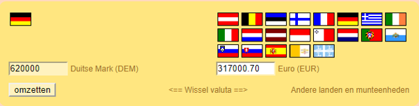
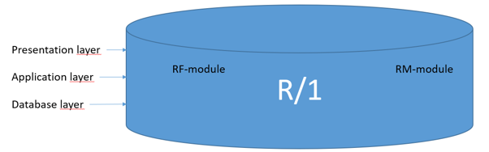
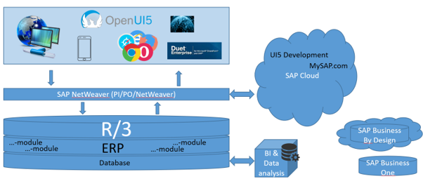

# SAP
Vroeger: SystemAnalyse und Programmentwicklung

Nu: (EN) Systems, Applications and Products (in Data Processing)

-> uitgebreid ERP

## Tijdlijn: 
x

 | 1972: oprichting SAP -> RF (boekhoudsysteem)

 | 1976: R/1 -> RM module

 | 1981: R/2 -> Vertalingen, internationaal

 | 1986: R/2: -> meer producten, nieuwe locaties

 | 1990: R/2: -> Investeringen, EU + USA

 | 1995: R/3: -> Wereldwijd, partnerships (Microsoft & IBM)

 | 2000: SAP Online: interfacing tussen andere online apps

 | 2010: Overnames & nieuwe producten

 | 2014: HANA DB + Cloud

 | 2016: S/4HANA

 | 2018: SAP Leonardo

V …

## Oprichting: 
- 1972, (Weinheim) Duitsland, 5 ingenieurs van IBM
    - werkten aan een enterprise software
    - opdracht ging naar andere afdeling maar zij wilden die voortzetten

- R = Real-Time Processing
## SAP RF module v1 (1972)
- zelfstandig begonnen met geleende computers
    - maakten een financieel boekhoudsysteem (= RF)
    - omzet na één jaar: 620.000 DM / 320.000 EUR

## SAP R/1 (1973 - 1976)
- 25 Werknemers, 40 klanten
- 1 = 1 Tier architectuur (SERVER 1 = Presentatie, Applicatie, Database)
- RM module
    - Aankoop
    - Magazijnbeheer
    - Facturatiebeheer
    

## SAP R/2 
- 2 = 2 Tier architectuur (SERVER 1 = Presentatie, Applicatie, SERVER 2 = Database)

### 1977 - 1981)
- Verhuis naar Waldorf
- Systemen op eigen servers
- Vertaling naar Frans: SAP gaat internationaal
- 50 Werknemers, 200 klanten

### (1982 - 1986)
- 250+ werknemers / +100 M DM (+50 M EUR)
- Nieuwe modules voor R/2: 
    - PPS (Product Planning module)
    - HR (Human Resource module)
    - RK (Costing module)
- Nieuwe vestiging in Zwitserland

### (1987 - 1990)
- +1700 Werknemers / +1000 klanten / +500M DM (+250 M EUR)
- SAP breidt uit naar bijna heel Europa en naar USA
- SAP Consulting (gericht op hulp voor kleinere bedrijven)

## SAP R/3
- 3 = 3 Tier architectuur (SERVER 1 = Presentatie, SERVER 2 = Applicatie, SERVER 3 = Database)

### (1991 - 1995)
- +7000 Werknemers / +2.7B DM (+1.4B EUR)
- SAP wereldwijd (Rusland, Azië, Zuid-Amerika)
- SAP op Windows NT (Microsoft)
- Contract met IBM: grootste contract tot dan

## SAP ONLINE (1996 - 2000)
- +24.000 Werknemers / 6.3B EUR
- Eerste interfaces (SAP PI) tussen andere online applicaties (via Microsoft)
- Doel:
    - Betere user experience
    - Makkelijker gebruik
    - Makkelijker customizen
- SAP BW module (business warehouse)
- BI & Data analysis

## SAP 2000 - 2010
- Veel overnames en nieuwe producten
- Netweaver, ERP, Microsoft Duet, UI5 (CLOUD)

## SAP (2011 - 2014)
### 2011:
- HANA Database:
    - Column based, in memory stored database
- SAP Successfactors

### SAP 2012:
- HANA cloud platform, SAP Ariba

### SAP 2013:
- HANA Database

### SAP 2014: 
- CLOUD
- Grootste Cloud-bedrijf ter wereld: +70M gebruikers
- SAP S/4 2015-2016
    - HANA DB, SAP Fiori
    - S/4 HANA in cloud, SAP Cloud & IoT
- Overname: SAP Predictive Analytics (Data analyse)

### SAP 2017 - …
- SAP Leonardo:
    - Hoogontwikkelde technologie
        - Augmented Reality
        - Blockchain
        - Artificial Intelligence
            - Machine Learning
            - Deep Learning
        - Cyborgs & Robotics
        - Automation

