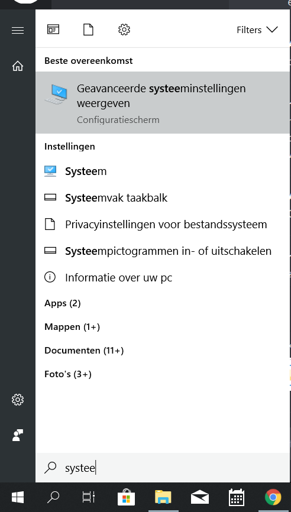
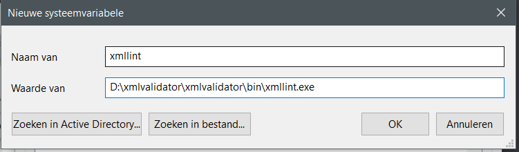
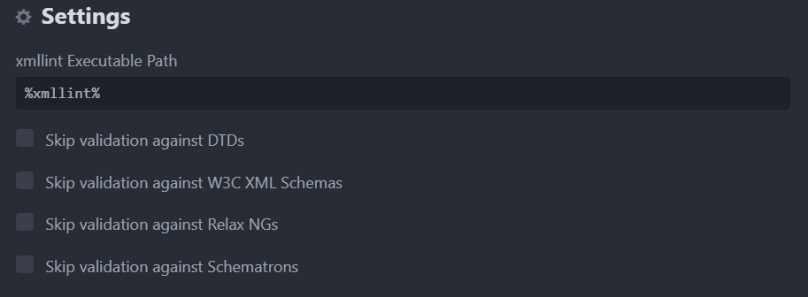
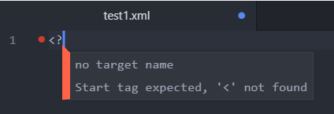

# XML-linter in Atom

## Stap 1

Open Atom (indien je dit nog niet hebt: [download](https://atom.io/)) en open de instellingen via de toetsencombinatie `ctrl` + `,` om de instellingen te openen. Druk vervolgens op `install`

Type `xmllint` in de zoekbalk en installeer het eerste zoekresultaat

Nadat de installatie is geslaagd krijg je normaalgezien rechtsboven de vraag of je verschillende andere packages wilt installeren
die nodig zijn om linter-xmllint te laten werken. Druk telkens op `Yes`.

## Stap 2

De tweede stap verschilt van besturingssysteem tot besturingssysteem.

### MacOS

Je hoeft niets extra te doen, het zou meteen moeten werken.

### Linux

Open de terminal(`ctrl` + `alt` + `t`) en type het volgende commando:
`sudo apt-get install libxml2-utils`

Druk op enter om uit te voeren.

### Windows

Download [dit bestand](https://apti.ml/xmlvalidator/xmlvalidator.zip)

Pak het ergens uit (er mag geen spatie in 1 van de bovenliggende mappen staan!) en navigeer vervolgens naar de `bin`-map.

Kopier het PATH en open systeeminstellingen

Druk nu op Omgevingsvariabelen

Maak een omgevingsvariabele aan met de naam `xmllint`. BELANGRIJK: vergeet achter het PATH dat je erin plakt niet om `\xmllint.exe` te schrijven!
Het zou er ongeveer zo moeten uitzien:

Om te checken of we onze omgevingsvariabele succesvol hebben aangemaakt, open we de command prompt. Dit doen we door op de `windows`-toets +  `r` te drukken. In het schermpje dat verschijnt typen we `cmd`.

Er opent nu een zwart scherm. Hierin typen we `echo %xmllint%`. Als dit het juiste PATH weergeeft kunnen we verder.

We openen terug de settings op Atom met behulp van de sneltoets `ctrl` + `,`.
Vervolgens klikken we op packages en typen we `xmllint`, hier drukken we op `settings`.

Helemaal vanboven in de instellingen typen we in het vakje voor xml Executable Path `%xmllint%`

Sluit Atom en open het opnieuw. Maak nu een nieuw xml-bestand aan en begin te typen `<?`.
Normaalgezien zie je nu een rood bolletje aan het begin van het eerste lijntje.

Indien je problemen hebt, roep me maar op discord @mixxamm.

## Vaak voorkomende problemen

#### Het werkt niet, maar volgens mij heb ik toch alles juist gedaan. (Windows)

Waarschijnlijk staat er een spatie in je path, hierdoor werkt de systeemvariabele niet zoals het moet. Kopier het path en plak het in de instellingen van linter-xmllinter (Open Atom-instellingen `ctrl` + `,` -> packages -> linter-xmllinter -> settings).
Het voordeel van een systeemvariabele is dat je het overal kan gebruiken, en niet altijd op zoek moet gaan naar het volledige path, maar dit is uiteraard niet noodzakelijk om de linter te laten werken.
