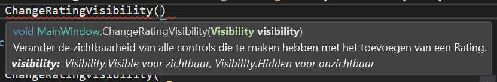

# Les 5 | WPF
De oefeningen van les 5, maar dan met WPF in plaats van Windows Forms. Dit is geen leerstof.

Het voordeel van WPF tegenover Windows Forms is dat je de layout in xaml maakt. Dit geeft meer controle over waar wat staat, biedt schaalvoordelen en daardoor ziet alles er gewoon veel "cleaner" uit. Ook kan ik hier makkelijk de het design bijvoegen omdat de code veel simpeler is en overal werkt.
## Oefening 5.1


### Het design (MainWindow.xaml)
```xml
<Window x:Class="WpfApp1_5._1.MainWindow"
        xmlns="http://schemas.microsoft.com/winfx/2006/xaml/presentation"
        xmlns:x="http://schemas.microsoft.com/winfx/2006/xaml"
        xmlns:d="http://schemas.microsoft.com/expression/blend/2008"
        xmlns:mc="http://schemas.openxmlformats.org/markup-compatibility/2006"
        xmlns:local="clr-namespace:WpfApp1_5._1"
        mc:Ignorable="d"
        Title="Dobbelspel" Height="450" Width="800">
    <Grid>
        <Label Content="{Binding LabelText}" Name="labelSaldo" HorizontalAlignment="Center" VerticalAlignment="Center" Margin="0,0,0,50"/>
        <Button
             Height="30px" Width="100px" Click="Gooien" Name="knopGooi">
            Gooien
        </Button>
    </Grid>
</Window>
```

### Klasse MainWindow (MainWindow.xaml.cs)
```csharp
public partial class MainWindow : Window
    {
        private const decimal START_GELD = 100.00m;
        private Geld geld;
        private Dobbelsteen dobbelsteen;
        public MainWindow()
        {
            InitializeComponent();
            geld = new Geld(START_GELD);
            dobbelsteen = new Dobbelsteen();
            labelSaldo.Content = geld;
        }

        private void Gooien(object sender, RoutedEventArgs e)
        {
            int worp = dobbelsteen.Gooi();
            if (geld.PasSaldoAan(worp) && geld.Saldo != 0)
                labelSaldo.Content = $"U hebt {worp} gegooid. {geld.ToString()}";
            else
            {
                labelSaldo.Content = "Geld is op.";
                knopGooi.IsEnabled = false;
            }
        }
    }
```
### Klasse Geld
```csharp
internal class Geld
    {
        public decimal Saldo { get; set; }

        public Geld(decimal saldo)
        {
            Saldo = saldo;
        }

        public bool PasSaldoAan(int aantal)
        {
            decimal aanpassing;
            switch (aantal)
            {
                case 1:
                    aanpassing = 20;
                    break;
                case 6:
                    aanpassing = 15;
                    break;
                default:
                    aanpassing = -10;
                    break;
            }
            if (Saldo + aanpassing < 0)
                return false;
            Saldo += aanpassing;
            return true;
        }

        public override string ToString()
        {
            return $"Huidig saldo: {Saldo}";
        }
    }
```
### Klasse Dobbelsteen
```csharp
class Dobbelsteen
    {
        static Random random = new Random();
        public int Gooi()
        {
            return random.Next(1, 7);
        }
    }
```
## Oefening 5.2


### Het Design (MainWindow.xaml)
```xml
<Window x:Class="WpfApp1_5._2.MainWindow"
        xmlns="http://schemas.microsoft.com/winfx/2006/xaml/presentation"
        xmlns:x="http://schemas.microsoft.com/winfx/2006/xaml"
        xmlns:d="http://schemas.microsoft.com/expression/blend/2008"
        xmlns:mc="http://schemas.openxmlformats.org/markup-compatibility/2006"
        xmlns:local="clr-namespace:WpfApp1_5._2"
        mc:Ignorable="d"
        Title="Bankrekening" Height="450" Width="800">
    <Grid>
        <Label Name="labelSaldo" HorizontalAlignment="Center" VerticalAlignment="Center" Margin="0,0,0,50"></Label>
        <StackPanel Orientation="Horizontal" HorizontalAlignment="Center">
            <Button Width="100px" Height="25px" Click="Storten">Storten</Button>
            <TextBox Width="100px" Height="25px" Margin="10,0,0,0" Name="textBoxHoeveelheid"></TextBox>
            <Button Width="100px" Height="25px" Margin="10,0,0,0" Click="Afhalen">Afhalen</Button>
        </StackPanel>
    </Grid>
</Window>
```
### Klasse MainWindow
```csharp
public partial class MainWindow : Window
    {
        Bankrekening bankrekening = new Bankrekening(100.00m);
        public MainWindow()
        {
            InitializeComponent();
            UpdateSaldo();
        }

        private void Storten(object sender, RoutedEventArgs e)
        {
            bankrekening.WijzigSaldo(decimal.Parse(textBoxHoeveelheid.Text));
            UpdateSaldo();
        }

        private void Afhalen(object sender, RoutedEventArgs e)
        {
            bankrekening.WijzigSaldo(-decimal.Parse(textBoxHoeveelheid.Text));
            UpdateSaldo();
        }

        private void UpdateSaldo()
        {
            if (bankrekening.Saldo < 0)
            {
                labelSaldo.Foreground = Brushes.Red;
                MessageBox.Show("Je bankrekening staat negatief!", "Opgelet!", MessageBoxButton.OK);
            }

            else
                labelSaldo.Foreground = Brushes.Black;
            labelSaldo.Content = bankrekening.ToString();//Iemand die weet waarom ik hier .ToString() moet doen? Pls leg uit thanks
        }
    }
```
### Klasse Bankrekening
```csharp
class Bankrekening
    {
        public decimal Saldo { get; private set; }
        public Bankrekening(decimal saldo)
        {
            Saldo = saldo;
        }

        public void WijzigSaldo(decimal hoeveelheid)
        {
            Saldo += hoeveelheid;
        }

        public override string ToString()
        {
            return $"Huidig saldo: {Saldo}";
        }
    }
```
## Oefening 5.3


### Het design (MainWindow.xaml)
```xml
<Window x:Class="WpfApp1_5._3.MainWindow"
        xmlns="http://schemas.microsoft.com/winfx/2006/xaml/presentation"
        xmlns:x="http://schemas.microsoft.com/winfx/2006/xaml"
        xmlns:d="http://schemas.microsoft.com/expression/blend/2008"
        xmlns:mc="http://schemas.openxmlformats.org/markup-compatibility/2006"
        xmlns:local="clr-namespace:WpfApp1_5._3"
        mc:Ignorable="d"
        Title="IMDb" Height="450" Width="800">
    <Grid>
        <Label Margin="7, 0, 0, 0">Wat wil je toevoegen?</Label>
        <StackPanel Margin="10, 20, 10, 10" Name="keuzePanel" >
            <RadioButton IsChecked="True" Name="serie" Click="CheckedChanged">Serie</RadioButton>
            <RadioButton Name="film" Click="CheckedChanged">Film</RadioButton>
        </StackPanel>
        <WrapPanel Orientation="Horizontal" VerticalAlignment="Top" HorizontalAlignment="Center" Margin="0,10,0,0" Name="PanelSerie">
            <WrapPanel Orientation="Vertical">
                <Label>Titel</Label>
                <TextBox Width="100px" Height="20px" Name="textBoxSerieTitel"></TextBox>
            </WrapPanel>
            <WrapPanel Orientation="Vertical" Margin="10,0,0,0">
                <Label>Aantal seizoenen</Label>
                <TextBox Width="100px" Height="20px" Name="textBoxSerieSeizoenen"></TextBox>
            </WrapPanel>
        </WrapPanel>
        <WrapPanel Visibility="Hidden" Orientation="Horizontal" VerticalAlignment="Top" HorizontalAlignment="Center" Margin="0,10,0,0" Name="PanelFilm">
            <WrapPanel Orientation="Vertical">
                <Label>Titel</Label>
                <TextBox Width="100px" Height="20px" Name="textBoxFilmTitel"></TextBox>
            </WrapPanel>
            <WrapPanel Orientation="Vertical" Margin="10,0,0,0">
                <Label>Producer</Label>
                <TextBox Width="100px" Height="20px" Name="textBoxFilmProducer"></TextBox>
            </WrapPanel>
            <WrapPanel Orientation="Vertical" Margin="10,0,0,0">
                <Label>Regisseur</Label>
                <TextBox Width="100px" Height="20px" Name="textBoxFilmRegisseur"></TextBox>
            </WrapPanel>
            <WrapPanel Orientation="Vertical" Margin="10,0,0,0">
                <Label>Genre</Label>
                <TextBox Width="100px" Height="20px" Name="textBoxFilmGenre"></TextBox>
            </WrapPanel>
            <WrapPanel Orientation="Vertical" Margin="10,0,0,0">
                <Label>Jaar</Label>
                <TextBox Width="100px" Height="20px" Name="textBoxFilmJaar"></TextBox>
            </WrapPanel>
        </WrapPanel>
        <Button Height="25px" Width="300px" Click="VoegToe">Voeg toe</Button>
        <WrapPanel HorizontalAlignment="Left" VerticalAlignment="Bottom" Margin="10,0,0,100">
            <ComboBox Height="25px" Width="200px" Name="comboBoxKeuze" SelectionChanged="ComboBoxKeuze_SelectionChanged"></ComboBox>
            <Label Name="labelRating" Margin="10,0,0,0"></Label>
        </WrapPanel>
        <Label HorizontalAlignment="Left" VerticalAlignment="Bottom" Margin="7,0,0,70" Name="labelNieuweRating" Visibility="Hidden">Geef een score van 1 tot 5</Label>
        <WrapPanel HorizontalAlignment="Left" VerticalAlignment="Bottom" Margin="10,0,0,48" Name="panelRating" Visibility="Hidden">
            <TextBox Height="25px" Width="95px" Name="textBoxRating"></TextBox>
            <Button Width="95px" Height="25px" Margin="10,0,0,0" Name="buttonVoegRatingToe" Click="ButtonVoegRatingToe_Click">Beoordeel</Button>
        </WrapPanel>
        <Image Height="320" Width="180" HorizontalAlignment="Right" VerticalAlignment="Bottom" Margin="0,0,40,40" Name="affiche"></Image>
    </Grid>
</Window>

```
### Klasse MainWindow (MainWindow.xaml.cs)
```csharp
public partial class MainWindow : Window
{
    private string rating = "De huidige rating voor {0} is {1}";
    private List<Film> films;
    private List<Serie> series;
    public MainWindow()
    {
        InitializeComponent();
        films = new List<Film>();
        series = new List<Serie>();
    }

    private void CheckedChanged(object sender, RoutedEventArgs e)
    {
        if ((bool)serie.IsChecked)
        {
            PanelSerie.Visibility = Visibility.Visible;
            PanelFilm.Visibility = Visibility.Hidden;
            SeriesUpdaten();
        }
        else
        {
            PanelSerie.Visibility = Visibility.Hidden;
            PanelFilm.Visibility = Visibility.Visible;
            FilmsUpdaten();
        }
    }

    private void VoegToe(object sender, RoutedEventArgs e)
    {
        if ((bool)film.IsChecked && IsFilled())
        {
            films.Add(new Film(textBoxFilmTitel.Text, textBoxFilmProducer.Text, textBoxFilmRegisseur.Text, textBoxFilmGenre.Text, int.Parse(textBoxFilmJaar.Text)));
            EmptyTextBoxes();
            FilmsUpdaten();
        }
        else if (IsFilled())
        {
            series.Add(new Serie(textBoxSerieTitel.Text, int.Parse(textBoxSerieSeizoenen.Text)));
            EmptyTextBoxes();
            SeriesUpdaten();
        }
        else
            MessageBox.Show("Niet alle velden zijn gevuld", "Opgelet!", MessageBoxButton.OK);
    }

    private bool IsFilled()
    {
        if ((bool)film.IsChecked)
            return textBoxFilmGenre.Text.Length != 0 && textBoxFilmJaar.Text.Length != 0 && textBoxFilmProducer.Text.Length != 0 && textBoxFilmRegisseur.Text.Length != 0 && textBoxFilmTitel.Text.Length != 0;
        else
            return textBoxSerieSeizoenen.Text.Length != 0 && textBoxSerieTitel.Text.Length != 0;
    }
    private void EmptyTextBoxes()
    {
        if (PanelSerie.IsVisible)
            foreach (WrapPanel wrapPanel in PanelSerie.Children.OfType<WrapPanel>())
            {
                foreach (TextBox textBox in wrapPanel.Children.OfType<TextBox>())
                    textBox.Clear();
            }
        else
            foreach (WrapPanel wrapPanel in PanelFilm.Children.OfType<WrapPanel>())
            {
                foreach (TextBox textBox in wrapPanel.Children.OfType<TextBox>())
                    textBox.Clear();
            }
    }
    private void SeriesUpdaten()
    {
        comboBoxKeuze.ItemsSource = null;
        comboBoxKeuze.ItemsSource = series;
    }
    private void FilmsUpdaten()
    {
        comboBoxKeuze.ItemsSource = null;
        comboBoxKeuze.ItemsSource = films;
    }

    private void UpdateFilmRating()
    {
        Film keuze = (Film)comboBoxKeuze.SelectedItem;
        try
        {
            labelRating.Content = string.Format(rating, keuze.Titel, keuze.Rating);
            ChangeRatingVisibility(Visibility.Visible);
            try
            {
                string result;
                using (WebClient client = new WebClient())
                {
                    result = client.DownloadString("https://sg.media-imdb.com/suggests/" + keuze.Titel.Substring(0, 1).ToLower() + "/" + keuze.Titel + ".json");
                }
                result = result.Substring(result.IndexOf("{"), result.Length - result.IndexOf("{") - 1);

                dynamic search = JsonConvert.DeserializeObject(result);
                string url = search.d[0].i[0];
                affiche.Source = new BitmapImage(new Uri(url));
            }
            catch (System.InvalidOperationException e)
            {
                labelRating.Content += "      |      Geen afbeelding gevonden :(";
            }
            catch (Exception e)
            {
                labelRating.Content += "      |      Er is iets fout gegaan tijdens het ophalen van de afbeelding.";
            }
        }
        catch (Exception)
        {
            ChangeRatingVisibility(Visibility.Hidden);
        }
    }

    private void UpdateSerieRating()
    {
        Serie keuze = (Serie)comboBoxKeuze.SelectedItem;
        try
        {
            labelRating.Content = string.Format(rating, keuze.Titel, keuze.Rating);
            ChangeRatingVisibility(Visibility.Visible);
        }
        catch (Exception)
        {
            ChangeRatingVisibility(Visibility.Hidden);
        }
    }
    /// <summary>
    /// Verander de zichtbaarheid van alle controls die te maken hebben met het toevoegen van een Rating.
    /// </summary>
    /// <param name="visibility">Visibility.Visible voor zichtbaar, Visibility.Hidden voor onzichtbaar</param>
    private void ChangeRatingVisibility(Visibility visibility)
    {
        labelRating.Visibility = visibility;
        labelNieuweRating.Visibility = visibility;
        buttonVoegRatingToe.Visibility = visibility;
        textBoxRating.Visibility = visibility;
        panelRating.Visibility = visibility;
    }

    private void ComboBoxKeuze_SelectionChanged(object sender, SelectionChangedEventArgs e)
    {
        if ((bool)serie.IsChecked)
            UpdateSerieRating();
        else
            UpdateFilmRating();
    }

    private void ButtonVoegRatingToe_Click(object sender, RoutedEventArgs e)
    {
        if ((bool)film.IsChecked)
        {
            Film keuze = (Film)comboBoxKeuze.SelectedItem;
            keuze.VoegRatingToe(double.Parse(textBoxRating.Text));
            textBoxRating.Clear();
            labelRating.Content = $"De huidige rating voor {keuze.Titel} is {keuze.Rating}";
        }
        else
        {
            Serie keuze = (Serie)comboBoxKeuze.SelectedItem;
            try
            {
                keuze.VoegRatingToe(double.Parse(textBoxRating.Text));
            }
            catch (System.FormatException)
            {
                MessageBox.Show("Kijk invoer na", "Ej!", MessageBoxButton.OK);
            }
            textBoxRating.Clear();
            labelRating.Content = $"De huidige rating voor {keuze.Titel} is {keuze.Rating}";
        }
    }
```
De summary boven de methode `ChangeRatingVisibility` zorgt ervoor dat je een korte omschrijving krijgt van wat de methode doet en waarvoor de parameters dienen als je de methode ergens in het programma probeert op te roepen.



### Klasse Film
```csharp
class Film
    {
        List<double> ratings = new List<double>();
        public string Titel { get; set; }
        public string Producer { get; set; }
        public string Regisseur { get; set; }
        public string Genre { get; set; }
        public int Jaar { get; set; }
        private double rating;

        public double Rating
        {
            get { return rating; }
            set
            {
                if (value <= 5 && value >= 1)
                    rating = value;
                else
                    rating = 2.5;
            }
        }

        public Film(string titel, string producer, string regisseur, string genre, int jaar, double rating)
        {
            Titel = titel;
            Producer = producer;
            Regisseur = regisseur;
            Genre = genre;
            Jaar = jaar;
            Rating = rating;//Zo heeft de default rating geen impact op de ratings die werden ingevoerd door de gebruiker
        }
        public Film(string titel, string producer, string regisseur, string genre, int jaar) : this(titel, producer, regisseur, genre, jaar, 2.5) { }

        public bool VoegRatingToe(double rating)
        {
            if (rating >= 1 && rating <= 5)
            {
                ratings.Add(rating);
                BerekenGemiddelde();
                return true;
            }
            return false;
        }

        public void BerekenGemiddelde()
        {
            Rating = ratings.Average();
        }

        public override string ToString()
        {
            return $"{Titel} - {Jaar}";
        }

    }
```
### Klasse Serie
```csharp
class Serie
{
    List<double> ratings = new List<double>();
    public string Titel { get; set; }
    public int Seizoenen { get; set; }
    private double rating;

    public double Rating
    {
        get { return rating; }
        set
        {
            if (value <= 5 && value >= 1)
                rating = value;
            else
                rating = 2.5;
        }
    }


    public Serie(string titel, int seizoenen, double rating)
    {
        Titel = titel;
        Seizoenen = seizoenen;
        Rating = rating;//Zo heeft de default rating geen impact op de ratings die werden ingevoerd door de gebruiker
    }

    public Serie(string titel, int seizoenen) : this(titel, seizoenen, 2.5) { }

    public bool VoegRatingToe(double rating)
    {
        if (rating >= 1 && rating <= 5)
        {
            ratings.Add(rating);
            BerekenGemiddelde();
            return true;
        }
        return false;
    }

    public void BerekenGemiddelde()
    {
        Rating = ratings.Average();
    }

    public override string ToString()
    {
        return $"{Titel} - {Seizoenen}";
    }

}
```
