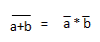

# Hoofdstuk 3

De wet van de uitgesloten derde: Elke booleaanse uitspraak is hetzij ‘waar’ hetzij ‘onwaar’

- Identiteit: uitspraak die altijd waar is
- Contradictie: uitspraak die altijd onwaar is

samengestelde uitspraak:

##### Disjunctie

- Notatie: p∨q (‘p of q’)
- De disjunctie p∨q is ‘onwaar’ enkel als p en q beide ‘onwaar’ zijn

##### Conjunctie

- Notatie: p∧q (‘p en q’)
- De conjunctie p∧q is ‘waar’ enkel als p en q beide ‘waar’ zijn

##### Ontkenning

- Als p waar is is ¬p onwaar
- Als p onwaar is is ¬p waar
  - ¬(¬p) = p

bewijs → waarheidstabellen, zie ppt 3.

##### Logische implicatie: p→q = ¬p∨q

- Notatie: p→q staat voor ‘als antecedens p, dan consequens q’
- De logische implicatie is enkel ‘onwaar’ wanneer p waar is en q onwaar is

##### De wet van de contrapositie: p→q = ¬q→¬p

##### Logische equivalentie: p↔q = (¬p∨q)∧(p∨¬q)

- Notatie: p↔q (‘p als en slechts als q’)
- De logische equivalentie p↔q = waar enkel als p en q dezelfde waarheidswaarde hebben (waar & waar = waar, onwaar & onwaar = waar)

##### Causale equivalentie (gelijkwaardigheid): p⇔q

- Indien p⇔q dan mag steeds p vervangen worden door q en vice versa

Axioma: een vanzelfsprekend voor ‘waar’ aangenomen uitspraak, zonder bewijs

##### Definitie van een structuur

- structuur = (verzameling,bewerkingen)
- Een structuur is een verzameling waarin een (aantal) zinvolle bewerking(en) worden gedefinieerd
- Voorbeeld: (W, ∨,∧,¬) met W = {onwaar,waar}

Paradox: een (schijnbare) tegenstrijdigheid die ingaat tegen ons gevoel voor logica, onze verwachting of intuïtie

##### Structuur (S, or,and,not) met

- de parallelschakeling van schakelaars in de rol van logische ‘of’ (‘or’)
- de serieschakeling van schakelaars in de rol van ‘en’ (‘and’)
- een relais in de rol van ‘niet’ (‘not’)

met S = {uit,aan}

## Operatoren

Xor: ‘uitsluitende of’ (‘exclusieve or’), exact 1 vd 2 is waar. (T.O.V.  or: 1 vd 2 of beide zijn waar.):

##### XOR


##### OR


##### AND


##### NOT


##### YES


! Waar we een losse ‘not’-poort moeten invoegen, zetten het ‘not’-poortsymbool onmiddellijk na het effectloze ‘yes’-poortsymbool:

##### YES+NOT


##### NOR

nor(a,b) = not(or(a,b)): 

##### NAND

nand(a,b) = not(and(a,b)): 

##### NXOR


- a nxor b = (not (a) or b ) and (a or not(b))
- a nxor b = (a and b) or (not(a) and not(b))

## Symbolen


2 rekenomgevingen zijn isomorf als ze een gelijke interne structuur vertonen

Voorbeeld: de rekenomgevingen

- (W, ∨,∧,¬) van de uitsprakenlogica en
- (S, or,and,not) van de schakelalgebra

zijn onderling isomorf

Notatie: (B, ∨,∧,¬) als de rekenomgeving van de Booleaanse algebra (B van Booleaanse waardenverzameling)

B = {0,1}, ‘0’ en ‘1’ zijn elkaar uitsluitende waarden en dus geen binaire cijfers

## Axioma’s van Huntington

##### Commutativiteit

- (a∨b=b∨a) = (a+b = b+a)
- (a∧b=b∧a) = (a\*b = b\*a)

##### Distributiviteit

- (a∨(b∧c)=(a∨b)∧(a∨c)) = (a+(b\*c) = (a+b)\*(a+c))
- (a∧(b∨c)=(a∧b)∨(a∧c)) = (a\*(b+c) = (a\*b)+(a\*c))

##### Associativiteit: de associativiteit van ∨ en ∧

- (a∨(b∨c)=(a∨b)∨c))  = (a+(b+c)) = ((a+b)+c)
- (a∧(b∧c)=(a∧b)∧c))  = (a\*(b\*c)) = ((a\*b)\*c)

##### Neutraal element

- (0∨a=a) = (0+a = a)
- (1∧a=a) = (1\*a = a)

##### Opslorpend element: 1 en 0 zijn het opslorpend element voor ∨, resp. ∧

- (1∨a = 1) = (1+a = 1)
- (0∧a = 0) = (0\*a = 0)

##### Uitgesloten derde: (!a = NOT a)

- (¬a∨a=1)  = (!a+a = 1)
- (¬a∧a=0)  = (!a\*a = 0)

##### Idempotentie: Elke booleaanse variabele a ∈ B is een idempotent element

- (a∨a = a) = (a+a = a)
- (a∧a = a) = (a\*a = a)

##### Wetten van De Morgan

- (¬(a∨b)=¬a∧¬b)  = (!(a+b) = !a \* !b)  = 
- (¬(a∧b)=¬a∨¬b)  = (!(a\*b) = !a + !b)  = 

##### Dubbele negatie

- (¬(¬a)=a) = (!(!a) = a)

##### Minimale booleaanse vorm: een logisch product van n factoren (hier 2) (\*)

- a1∧a2, ¬a1∧a2, a1∧¬a2, ¬a1∧¬a2

##### Maximale booleaanse vorm: een logische som van n termen (hier 2) (+)

- a1∨a2, ¬a1∨a2, a1∨¬a2, ¬a1∨¬a2

functies: zie ppt. 16 functies bij 2 veranderlijken omdat elk element 4 waarden kan hebben: 4\*4=16. waarvan 2 constante functies, 4 minimale, 4 maximale en 6 disjunctieve + normaalvormen

##### disjunctieve normaalvorm dnv(f)

→ dnv(xor(a,b) = (¬a∧b) ∨ (a∧¬b) → minimale vormen (\*)

##### conjunctieve normaalvorm cnv(f)

→ cnv(xor(a,b) = (a∨b) ∧ (¬a∨¬b) → maximale vormen (+)

##### disjunctieve eenvoudigste vorm dev(f)

→ dev(or(a,b) = (a∨b)

## Karnaughkaart

Gray-getalformaat: uitgedrukt in bitpatronen. Telkens 1 bit veranderen. als je alle opties hebt gehad, 1 bit ervoor op 1 zetten. Volgorde maakt niet uit, zolang je alle opties hebt gehad en dat de x- en y-as van de grafiek/kolommen gelijk zijn.

Voorbeeld:

```
     0   1    10  11  110  111  101  100
0
1
10
11
110
111
101
100
```

Normaliseren:

- biedt meer inzicht in de functie
- functies te vergelijken

de karnaughkaart van een functie is een vlak gevuld met booleaanse waarden begrensd door 2 ‘grafiek-assen’ die genummerd zijn in het Gray-formaat

Normaliseren van functies: zoek alle waarden waarvoor de uitkomst ‘waar’ is en zet deze om in een formule. Voorbeeld: dnv(or(a,b)) =  (a∧¬b) ∨ (¬a∧b) ∨(a∧b). Dit is makkelijker met behulp van de karnaughkaart:


Deze uitkomst kunnen we vereenvoudigen door 2<sup>x</sup> 1tjes samen te nemen in een groep. Per 2, 4, 8 … In de karnaughkaart hierboven zie je dat op voor a (verticaal) bij kolom 1, 2x 1 onder elkaar staat. hieruit kunnen we opmaken dat als a 1 is, b ook 1 is. idem voor b (horizontaal). Dit vereenvoudigen we door dnv(or(a,b)) = a∨b ofwel a+b. We tellen dus de 2 groepen op.

Uitleg bij voorbeeld 2 (zie ppt):

- als c 1 is, zijn a en b ook altijd 1.
- als a en b beide 1 zijn, is c ook altijd 1.

→ dev(f(a,b,c)) = (a∧b)∨c  ofwel (a\*b)+c

→ aangezien a en b in 1 kolom staan, moeten we er een product van maken. dit product tellen we dan op met c. had de verticale lijn hier bv.c en d geweest, hadden we misschien ee product van a en b + een product van c en d ((a\*b)+(c\*d))

opmerking: Voorbeeld 3:


de twee grijze rechthoeken zijn cilindrisch aaneengesloten tot één vierkant. we kunnen deze hier samennemen tot !b (NOT b) omdat a nu zowel 1 als 0 is, ofwel !a \* a = 0 en !b \* !b = !b, dus 0 + !b = !b

→ dev(g(a,b,c)) = ¬b

Voorbeeld 4: de 4 hoeken vormen samen 1 vierkant. zowel a als x veranderd (000, 100: het eerste getalletje veranderd zo ook het eerste lettertje van de functie) en b, c, y en z veranderen niet. Zij blijven altijd 0 → NOT b, NOT c, NOT y, NOT z. Deze vermenigvuldigen (want we zitten in 1 groep) maakt dev(h(a,b,c,x,y,z)) = ¬b∧¬c∧¬y∧¬z (ofwel !b\*!c\*!y\*!z)

om economische en productionele redenen wordt er meestal de NAND-technologie gebruikt in praktijk:

f(a,b,c,d) =

- (a∧b) ∨ (c∧d)
- nand(nand(a,b),nand(c,d))
