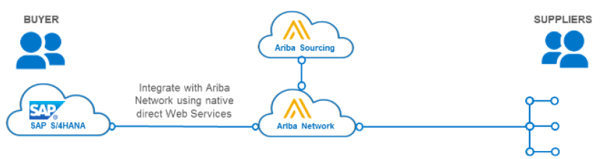

# Korte samenvatting
## History
<b>Tijdlijn:</> 
x

 | 1972: oprichting SAP -> RF (boekhoudsysteem)

 | 1976: R/1 -> RM module

 | 1981: R/2 -> Vertalingen, internationaal

 | 1986: R/2: -> meer producten, nieuwe locaties

 | 1990: R/2: -> Investeringen, EU + USA

 | 1995: R/3: -> Wereldwijd, partnerships (Microsoft & IBM)

 | 2000: SAP Online: interfacing tussen andere online apps

 | 2010: Overnames & nieuwe producten

 | 2014: HANA DB + Cloud

 | 2016: S/4HANA

 | 2018: SAP Leonardo

V …

## HCM
- <b>Organisatie</b> van het personeel binnen een organisatie
    - Enterprise Structure, Personnel Structure, Organizational Plan
- <b>Master Data</b>
    - Personeelsnummer (reference number) & infotypes
- <b>Processen:</b> Analyseren & gebruiken of aanmaken & beheren van data
- <b>Recruitment Process:</b>
    > Vrije werkgelegenheid -> Advertentie -> sollicitatie/aanbieding -> Selectie -> Aannemen
    - Beheer database voor sollicitaties & vrije posities binnen het bedrijf
	    - Group: Actieve werknemers, Non-actieve werknemers, studenten …
	    - Range: Arbeider, bediende, specialist
    - Selectie: 
	    - Global: algemene sollicitatie
	    - Per werkgelegenheid
- <b>Personnel development:</b> Requirements & Qualifications
    - Profile matchup
    - Talent management: Development planning (education), Succession planning (carrière)
- <b>Performance management</b>
	- evaluate employees -> adjust bonuses
	- GOAL: +motivation +benefits
- <b>Personnel controlling:</b> data voorzien, in rapporten steken en analyseren: ESS / MSS
- <b>S/4HANA</b> -> Successfactors: next Gen HCM-suite in de Cloud (tov ECM on premise)

## SD
- <b>Sales Area:</b>
    - Combination of Sales Organization, Distribution Channel and Division
- <b>Master data:</b>
    - Customer, material, condition
- <b>Sales order Process:</b>
> Pre-sales activities -> sales order entry -> check availability -> pick materials -> pack materials -> post goods issue -> invoice customer -> receipt of customer payment

- Header: Customer data, total cost of the order
- Line Item: Material and quantity, cost of an individual line
- Schedule Line: Uniquely for Line Item: quantities and dates deliveries, shipping information (route determination), billing Information

- <b>Scheduling:</b>
	- Delivery date per Line item
	- Delivery timeline: forward or backward scheduling

- <b>Shipping:</b> start + end point, route, transit time
    - Availability check: when materials available? (consider all inventory movements)
    - Order combination (+ orders together), partial delivery (in parts) or complete delivery

- <b>Credit check:</b> systeem kijkt credit situation van klanten na (op betrouwbaarheid) en kan wanneer ingesteld zelf orders & deliveries blokkeren.

- <b>Delivery:</b> availability, requirements, weight & volume
    - Picking: quantities, where and when to pick, lot number tracking
    - Packing & loading:  packaging, weight/volume restrictions
    - Goods issue: change legal ownership of products, inventory reduces

- <b>Billing:</b> generate customer invoice
    - Debit to ledger, credit to revenue
    - Delivery based, Collective (+ together), Split invoicing

- <b>Payment:</b> Finance
    - Vergelijk invoice en payment
    - Increases bank account

- <b>SAP S/4HANA</b>
    - Business Partner = single point of entry for master data about persons (customer, vendor…)
        - Organisation / Group
    - Analyses: ODATA & Open CDS
    - Credit management verplicht in S/4 (goed voor bedrijven met veel business partners)

## Materials Management (MM)
- <b>Master data:</b>
    - Vendor: supplier data
    - Material: used everywhere
    - Purchasing: relation between vendor and material

- <b>Procure-To-Pay Process</b>
> Purchase requisition -> Vendor selection -> Purchase order -> Notify vendor -> Vendor shipment -> Goods receipt -> Invoice receipt -> Payment to vendor

- <b>Requisition:</b> waar nodig, waar verkrijgbaar?
    - Vendor selection: waar verkrijgbaar binnen gegeven termijn?
    - Long time agreements: contracts (hoeveelheid en waarde), delivery schedule agreement (1x kopen, komt om de zoveel tijd aan)
    - Request for quotation (rfp voor prijs -> ask for a bid) -> bid is legally binding

- <b>S/4HANA</b>
    - Ariba: source-to-pay process

## Gastcollege 1: Mendix
- <b>Mendix:</b> low-code, grafische tools (zonder code) platform voor web en mobile apps
    - miscommunicatie -> 1 taal
    - te weinig IT-ers -> makkelijker samenwerken
    - oude legacy systemen -> cloud based oplossing die bovenop legacy werkt

- Through 2021, business demand for app development will grow at least 5x faster than IT capacity to deliver it
- By 2024, more than 65% of all new business applications will be developed on high productivity platforms

## Gastcollege 2: S/4HANA
- <b>r3:</b> 
    - alle schermen, dus ook diegene die niet voor jou zijn: vervuilde gui. 
    - meer toegespitst in snelle input, maar wel onthouden welke velden voor jou zijn
    - database kan geen zware loads aan -> secundaire tabellen: opsplitsen per onderwerp om ietwat performantie te krijgen.
    - logica in application layer -> heel veel data doorpushen -> bottleneck

- <b>s4:</b> 
    - rolgericht, alleen voor jou: meteen klikken, niet zoeken
    - exception driven: rode cijfers in fiori
    - kan zware loads aan
    - logica in database layer -> minder gegevens doorpushen -> performantie
    - Geen BW nodig!

- <b>sap → cloud</b>, maar klant vertrouwt dat niet
    - wel backwards compatible met vorige versies: klant blij maar SAP moet support geven

- ECC = netweaver systeem, beetje fiori de rest SAP gui. Draait op alle db
- Suite on HANA : erp op HANA, zowel Fiori als SAP Gui
- S/4HANA = Fiori UX + HANA + Simplification

- <b>SAP Fiori<b>
    - responsief, grafisch, simpel maar functioneel

## Gastcollege 3: SAP Cloud Platform
- intelligent suite 
- digital platform 
- intelligent technologies

- <b>Mobile apps:<b>
    - Cloud Foundry Environment
    - NEO Environment
    - ABAP Environment

- cloud platform cockpit
- global account met subaccounts

- <b>SAP Leonardo:</b> vb koffiemachine