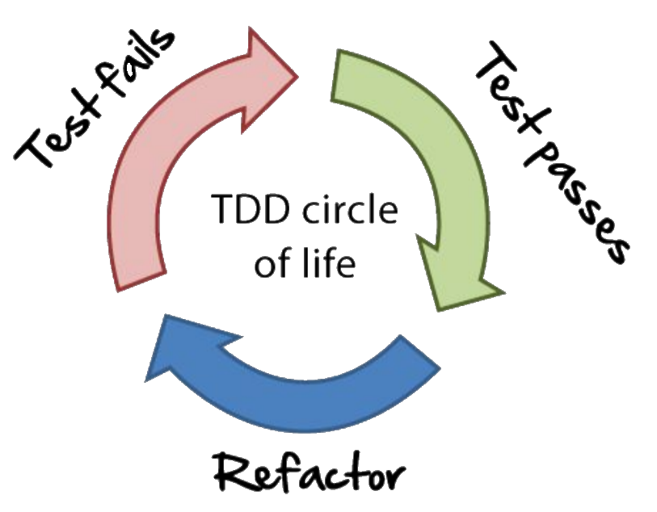

# Software Engineering Samenvatting

## Gamification

Voordelen:

- Leuk
- Overal mogelijk
- Competitief
- Engagement

Nadelen:

- Kan belangrijker worden dan doel
- Niet voor iedereen

## Testing

Waarom testen we?

- Mensen maken fouten
- Kwaliteit garanderen
- Klant & ontwikkelaar geruststellen
- Werkt het programma zoals verwacht?

### Automatisch testen

#### Waarom

- Testen uitvoeren die mensen niet kunnen uitvoeren
- Meer testen uitvoeren
- Tijd en geld besparen
- Kwaliteit en vertrouwen groeit

#### Wat kunnen we automatisch testen

- Testen die heel veel tijd of moeite kosten
- Testen die je niet manueel kan uitvoeren
- Testen die gevoelig zijn voor menselijke fouten
- Steeds wederkerende testen

##### Voorbeelden

###### Test Level

UCIS

- Unit Testing
- Component Testing
- (System) Integration Testing
- System Testing

###### Test Type

PReSSFeL

- Performance testing
- Regression testing
- Security testing
- (Load) & Stability testing
- Functional testing
- Load & (Stability) testing

### Performantietesten

#### Soorten

- Load testen
  - Performantie van het systeem testen met een normaal aantal gebruikers/data
- Soak testen
  - Performantie van het systeem testen met een constant normaal aantal gebruikers/data
- Spike testen
  - Performantietest met plotselinge pieken in gebruikers/data
- Stresstest
  - Performantietest om het breekpunt van het systeem vast te stellen a.d.h.v. een extreem aantal gebruikers/data

#### Doel

- Responsetijd
- Acceptatie
  - Stabiliteit
- Regressie
  - Werkt de nieuwe versie even snel?
- Betrouwbaarheid
  - Kan het systeem een hoog aantal gebruikers/data aan?
- Bottleneck identificeren

### Golden master testing

Je maakt een nieuwe branch vanaf de `master`-branch. Je wijzigt de code op de nieuwe branch en test met willekeurige data. Als het resultaat hetzelfde is op de nieuwe branch, weet je dat je wijzigingen aan de code op de nieuwe branch geen functionaliteit breken, en kan je dus veilig terug mergen met de `master`-branch. Als dat niet het geval is, weet je dat je iets hebt kapot gemaakt, en moet je dus opnieuw beginnen vanaf de `master`-branch.

## Legacy code

### Simple design

1) Slaagt voor alle testen
2) Zo weinig mogelijk duplicatie van concepten
3) Zo leesbaar mogelijk; de code onthult de intentie
4) Bevat enkel de noodzakelijke code

## Database Performantie

### Agnostische aanpak

Voordelen:

- Logica staat los van database
  - Kan vrij van database wisselen
- Protocol om naar database te gaan wordt gegenereerd

Nadelen:

- Kracht van specifieke database wordt niet gebruikt
- Oorzaken van performantieproblemen zijn moeilijker te vinden

### Thick database

Voordelen:

- Kracht van specifieke database wordt gebruikt
- Performantieproblemen kunnen makkelijker gelocaliseerd worden
- Data integriteit beheren is makkelijker

Nadelen:

- Hangt vast aan één database
- Logica aanpassen gebeurt in database

#### Lagen

- Gegevensschema
  - Tabellen
- Code schema
  - Procedural Language/Structured Query Language (PL/SQL)
- Toegangsschema
  - Security

### Optimalisatietechnieken

#### Rules Based Optimization (vroeger)

- Werkt op basis van een aantal vooropgestelde regels (bv. als er een index is doe dit, anders doe dat) en zou dus in theorie het snelste een resultaat moeten teruggeven.

#### Cost Based Optimization

- Berekent de kostprijs van verschillende operaties, en geeft een resultaat terug volgens de snelst mogelijke route.

### Bulk processing

- In de plaats van verschillende queries te doen voor CRUD-operaties op verschillende rijen, gewoon alles in 1 keer doen.

### Clustered index

- De data is fysiek op de schijf in dezelfde volgorde opgeslagen als de index. Hierdoor kan er slechts 1 clustered index zijn per tabel. Een non-clustered index daarentegen heeft pointers naar de fysieke rijen. Hierdoor is het sneller om data op te vragen a.d.h.v. een clustered index, maar doorgaans trager om data toe te voegen aan een tabel die een clustered index bevat, omdat de data opnieuw volledig fysiek herordend moet worden op de schijf.

## Theorie of Constraints (TOC)

- Er is altijd minstens 1 constraint.
- TOC identificeert de constraint en herstructureert de rest van de organisatie errond.
  - Laat de bottleneck focussen. Zorg dat de bottleneck niet wordt afgeleid door werk dat niets met de doorvoer te maken heeft.
- TOC werkt volgens het principe "de sterkte van de ketting wordt bepaald door de zwakste schakel".
  - Dit betekent dat het proces of de organisatie kwetsbaar is omdat de zwakste persoon of het zwakste deel altijd een impact kan hebden op de uitkomst van de processen.

### Focusing steps

0) Wat is het doel?
1) Waar bevindt de bottleneck zich?
2) Laat de bottleneck focussen.
3) Pas aan aan de bottleneck.
4) Maak de bottleneck groter. (meer resources op de plaats van de bottleneck plaatsen, zodat het sneller vooruit gaat)
5) Herhaal vorige stappen.

(6. Verander het systeem.)

## Extreme Programming

FC SRC
XP Values

- Feedback
- Communication

- Simplicity
- Respect
- Courage

Een aantal XP Practices

- Pair Programming
- Test Driven Development
  - 
- Continueous Integration
- Refactoring
- Small Releases
- Collective Code Ownership
- Sustainable Pace

## .NET Performance

### LINQ

- Language-Integrated Query Language
- Kan zowel in methode-als query-vorm geschreven worden.

#### LINQ to entities optimizations

|Actie|Wanneer|
|-|-|
|Eager loading|Als er een grote kans is dat de data snel zal worden opgevraagd|
|Lazy loading|Als er een kleine kans is dat de data snel zal worden opgevraagd|
|Precompiled query|Queries die vaak gebruikt worden|
|Queries debuggen|Als je queries complexe logica bevatten|

### TPL

- Task Parallel Library
- Sinds .NET 4.0
- Makkelijkere manier om multi-threaded te werken
  - Tasks
    - Vergelijkbaar met Promises in JavaScript
    - Functies die een `Task`/`Task<T>` returnen zijn `awaitable`
      - Gebruik het `await`-keyword om de huidige functie te pauzeren totdat de opgeroepen functie een resultaat teruggeeft. Ondertussen kan de oproeper verder andere taken uitvoeren.
        - Om ervoor te zorgen dat je `await` kan gebruiken, moet je de functie als `async` markeren.
    - Je kan meerdere taken die elkaar niet verhinderen gelijktijdig uitvoeren. Daarna kan je gebruik maken van `Task.WhenAll()` om verder te gaan als alle `Task`s klaar zijn.

#### Parallel vs Concurrent

- Parallel wilt zeggen dat de taken effectief door verschillend CPU's worden uitgevoerd (een CPU kan maar 1 ding tegelijk doen).
- Concurrent wilt zeggen dat de CPU slim zijn rekentijd verdeelt over de taken, en het zal lijken alsof deze taken gelijktijdig worden uitgevoerd.
