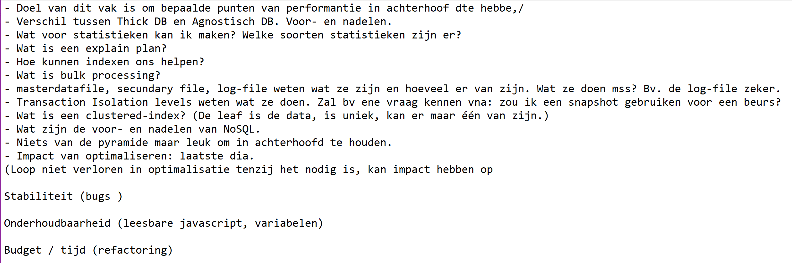
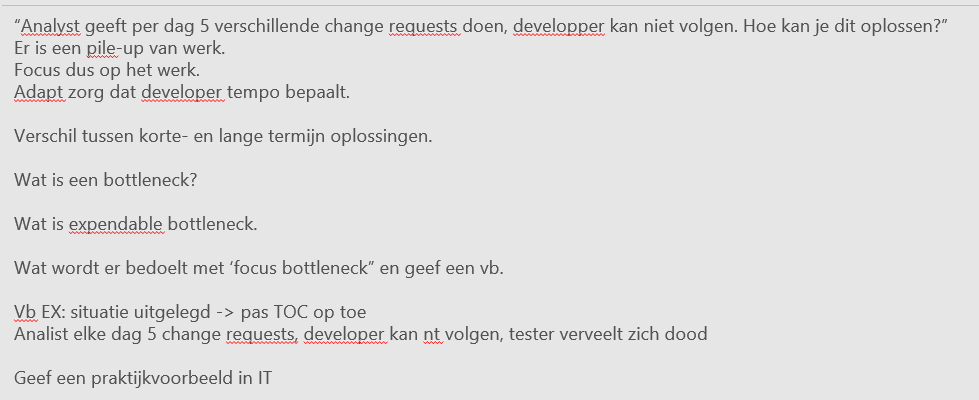
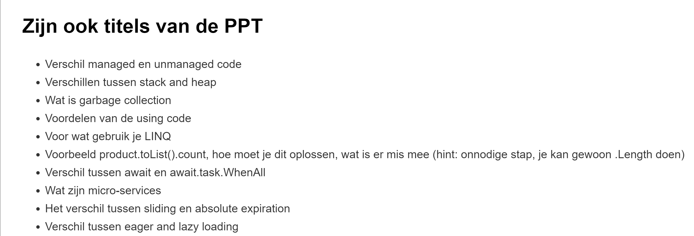

# Samenvatting SE

## Intro

Kunnen performantiewinst verkrijgen door:

* Performance testing
  * Code
* Legacy code
  * Code
  * Organisatie
* Test Driven Development
  * Code
  * Organisatie
* Performance in coding
  * Code
* DB performance
  * Database
* Organisational performance
  * Organisatie

## Les 1: Software and Performance Testing

### Gamification

* __Wat is gamification?:__
  * Een bestaand proces in een bedrijf zoals een bedrijfsapplicatie of een website om te zetten in een spelvorm met beloningen, achievements, uitdagingen en user-betrokkenheid. Dit alles met als doel om business value toe te voegen aan het bedrijf. Het doel van dit spelvorm is dan om zo snel mogelijk in levels te stijgen om de hoogste niveau te bereiken.
  * Voorbeeld:
    * Rollen: Dorpeling -> Schildknaap -> Ridder -> Koning(in). Om ter eerste bij koning. Dit kunnen ze doen door goed te presteren.

| Voordelen       | Nadelen               |
| --------------- | --------------------- |
| Leuk            | Niet voor iedereen    |
| Competitief     | Belangrijker dan doel |
| Overal mogelijk | /                     |
| Engagement      | /                     |

### Software performance testing

* __Waarom testen we?__
  * Mensen maken fouten
  * Is dit wel wat er afgesproken is?
  * Kwaliteit opleveren
  * Klant geruststellen
  * Ontwikkelaar geruststellen
* __Wanneer testen we?__
  * Zo vroeg mogelijk aangezien hoe later in bugs in het project worden ontdekt, hoe duurder dit zal uitkomen. => Hoe vroeger, hoe goedkoper.
* _2 methodologieën (NK maar wel nuttig)_:
  * _Waterfall_
    * _Planning -> Analyse -> Design -> Build -> Test -> Deliver_
  * _Agile_
    * _In sprints werken, en op het einde van elk sprint een werkend product/functionaliteitenset afleveren._
* __Wat zijn regressietesten?__
  * Testen die worden uitgevoerd op de niet-aangepaste onderdelen van een applicatie om te kijken of ze nog werken of niet.

| term         | Continuous Integration (CI)                                                                                                                                                 | Continous Delivery (CD)                                                                                                                       | Continuous Deployments                                                                                                 |
| ------------ | --------------------------------------------------------------------------------------------------------------------------------------------------------------------------- | --------------------------------------------------------------------------------------------------------------------------------------------- | ---------------------------------------------------------------------------------------------------------------------- |
| Definitie    | Zoals het woord zegt, continu integreren. Werkende code die door developers wordt geschreven, wordt meermaals op de main branch van de code gemerged en automatisch getest. | Een aanpak waar er continu werkende software in kleine cycli wordt opgeleverd én op elk ogenblik gereleased kan worden. Dit is de stap na CI. | De stap die volgt na CD. Hier zullen de deployable softwarepakketjes ook effectief uitgerold worden naar de productie. |
| Samenvatting | Coderen -> Applicatie testen -> Integratietesten                                                                                                                            | {Continuous Integration} -> Acceptance testing                                                                                                | {Continuous Delivery} -> Productie                                                                                     |
| Achievements | Test automatisatie                                                                                                                                                          | Opleverbare software                                                                                                                          |                                                                                                                        |
|              | Build automatisatie                                                                                                                                                         | Goede samenwerkende band                                                                                                                      |                                                                                                                        |
|              | Deploy automatisatie                                                                                                                                                        | Deployment pipeline                                                                                                                           |                                                                                                                        |
|              | Code repository                                                                                                                                                             |                                                                                                                                               |                                                                                                                        |
|              | Daily check-in                                                                                                                                                              |                                                                                                                                               |                                                                                                                        |
| Voordelen    | Vroeg bugs ontdekken                                                                                                                                                        | Snel & geautomatiseerde feedback                                                                                                              |                                                                                                                        |
|              | Quality of delivery (door continu feedback klant)                                                                                                                           | Quality of delivery (aangezien je een werkend product kan opleveren)                                                                          |                                                                                                                        |
|              | Verhoogde release-ritme (continu opleveren)                                                                                                                                 | push-button deployments (kant-en-klare software die op elk moment geleverd kan worden)                                                        |                                                                                                                        |
| Nadelen      | Initiële setup (aangezien alles geautomatiseerd is)                                                                                                                         | DevOps team nodig (Goede samenwerkende developers)                                                                                            |                                                                                                                        |
|              | Continu onderhoud                                                                                                                                                           | Test omgeving nodig                                                                                                                           |                                                                                                                        |
|              | Extra kosten                                                                                                                                                                | Deployments fouten kunnen gebeuren                                                                                                            |                                                                                                                        |

* __Waarom automatisch testen?__
  * Testen uitvoeren die mensen niet kunnen uitvoeren.
  * Meer testen kunnen uitvoeren (dan manueel).
  * Kan over een grote coverage testen en op (bijna) alles.
  * Tijd en geld besparen.
  * Kwaliteit en vertrouwen groeit (door automatische testen kan het team meer uitdagendere projecten uitvoeren wat hun skillset en zelfvertrouwen doet groeien).
* __Wat kunnen we automatisch testen?__
  * Test Level
    * _Code -_ __Unit testing__
    * _Low Level -_ __Component testing__
    * _High Level -_ __Integratietesten__
    * _Systeem -_ __System testen__
  * Test Type
    * __Performance testen__
    * __Load & Stability testen__
    * __Regressietesten__
    * __Security testen__
    * __Functioneel testen__
* _Wat voor testen zou je automatiseren?_
  * _Testen die veel tijd/moeite kosten._
  * _Testen die je niet manueel kan uitvoeren._
  * _Testen die gevoelig zijn voor menselijke fouten._
  * _Steeds wederkerende testen._

| Soort performantietest | Definitie                                                                          |
| ---------------------- | ---------------------------------------------------------------------------------- |
| Loadtesten             | Performantie van systeem testen met een normaal aantal gebruikers/data             |
| Soak testen            | Performantie bekijken bij constant normaal aantal gebruikers/data                  |
| Spike testen           | Performantie bekijken bij plotselinge pieken in gebruikers/data                    |
| Stresstesten           | Het systeem testen met een extreem aantal gebruikers/data en breekpunt vaststellen |

* __Wat is het doel van de performantietesten?__
  * __Response tijd__: hoe lang duurt het voor ik antwoord krijg?
  * __Acceptatie__: is het stabiel genoeg om in productie te gaan?
  * __Regressie__: werkt de nieuwe versie even goed?
  * __Betrouwbaarheid__: kan het een hoog aantal gebruikers/data aan?
  * __Bottleneck identificeren__: waar loopt het net fout?

|           | Golden Master testing                                                                                                                                                                                                                |
| --------- | ------------------------------------------------------------------------------------------------------------------------------------------------------------------------------------------------------------------------------------ |
| Definitie | Je pakt een gekend input, steekt het in een methode, bekijkt de output en vergelijkt het met een goedgekeurde versie van de output. Indien dit slechter is, pas je het programma aan. Als dit beter is, pas je de Golden Master aan. |
| Voordelen | Moet Business Rules niet kennen                                                                                                                                                                                                      |
|           | Leert bij over applicatie                                                                                                                                                                                                            |
|           | Vertrouwen                                                                                                                                                                                                                           |
| Nadelen   | Floats vergelijken                                                                                                                                                                                                                   |
|           | Oplopende ID's vergelijken                                                                                                                                                                                                           |
|           | Timestamps vergelijken                                                                                                                                                                                                               |
|           | Willekeurige volgorde                                                                                                                                                                                                                |


## Les 2: Legacy code performance

[GitHub](https://github.com/kynan/trivia)

### Improving performance of legacy codebases

* _Doelen van deze les:_
  * _Technieken leren om bestaande legacycode te verbeteren._
  * _Uzelf trainen om anders te denken rond refactoren._
  * _Uzelf confronteren op de manier dat je programmeert._
  * _Pair programming oefenen._

* __Wat is Refactoring?__:
  * Interne lijntjes code aanpassen zonder dat de output van dat stukje code wijzigt.
  * Hoe testen dat het niet is aangepast?:
    * Is uitvoeren...
* __Wat is Simple Design?__:
  * Een design principe dat je oplegt om goede software te maken.
  * Uit welke 4 elementen bestaat dit?:
    * Geslaagd zijn voor zijn testen.
    * Duplicatie van code en concepten vermijden.
    * Begrijpbare en duidelijke code.
    * Weinig elementen. Schrijf enkel code dat echt nodig is.
* _Code bekijken_
* __Wat is Reveal Intent?__:
  * Het encapsuleren, hernoemen en verduidelijken van stukken code met een niet-betekenisvolle voorkomen.
    * Magic numbers/strings in de code encapsuleren en een symbolische constante die de betekenis van die nummer/string weergeeft geven.
      * Bv: van ```if (x < 5) ...``` naar ```int MAX_AANTAL_SPELERS = 5; if (x < MAX_AANTAL_SPELERS) ...```
    * Variabele/methode/classes met niet-beschrijvende namen hernoemen naar iets langs dat het wel goed beschrijft om de betekenis er achter duidelijk te maken.
      * Bv: van ```public void MaalTwee(int a) { return a * 2; }``` naar ```public void ResultaatVerdubbelen(int a) { return a * 2;}```
  * Op iteratieve wijze telkens de naam inkorten tot het op zijn kortst is terwijl het zijn betekenis in het domein niet verliest en niet voor synoniemen zorgt met een ander concept.

* **From nothing to system tests**
  * Zoek een entry-point op zo hoogst mogelijk niveau van uw programma dat communiceert met een externe interface/framework
  * Stel een limiet op deze call dat je belemmert om deze resultaat automatisch te laten verbeteren
  * Stel een fake limiet in om  de resultaten op te vangen.
* **Encapsulate external dependencies**
  * Zoek een methode die een externe call doet (IO, Framework...)
  * Encapsuleer de logica die ook effectief de call doet
  * Steek deze in een nieuwe class
  * Maak deze class abstract zodat hiervan geen objecten van gemaakt kunnen worden
  * Maak deze method static zodat deze van overal bereikt kan worden
  * Doe in uw originele method een call naar deze static method
  * Zo kan je deze externe call in uw test-clausules testen zonder in uw class zelf te zitten.
* __Extracting methods__:
  * Methodes die meerdere stukken code bevatten van verschillende functionaliteiten elks er van encapsuleren, in een ander methode steken en een naam geven. (Dus elk functionaliteit in die ene grote functionaliteit encapsuleren).
* __Wat is Refactoring Conditionals?__:
  * Een logische expressie encapsuleren en vervangen door een methode of variabele met een naam dat deze logica beschrijft.
    * Bv: van ```if (x < MAX_AANTAL_SPELERS) ...``` naar ```if (IsGeldigAantalSpelers(x)) ... public bool IsGeldigAantalSpelers(int x) return x < MAX_AANTAL_SPELERS;```
  * __Explaining variable__:
    * Een logische expressie vervangen door een variabele met een beschrijvende naam. Dit zorgt er voor dat je niet opnieuw moet uitvogelen waar die expressie voor diende.
      * Bv: van ```if ((a*50+2-3+438) / 2 == 5) ...``` naar ```bool isEenGeldigKaart = (a*50+2-3+438) / 2 == 5; if(isEenGeldigKaart)...```
  * __Consolidate Conditional Expression__:
    * De combinatie van meerdere conditionele expressies of compositie condities die elkaar volgen encapsuleren d.m.v. een methode met een beschrijvende naam.
    * Bv. van ```if (a > 40) if (b > 30) if (c > 20)``` naar ```if (a>40 && b > 30 && c >20)``` naar ```if (ZijnVolwassen()) ... public bool ZijnVolwassen(int a, int b, int c) return a>40 && b > 30 && c >20;```
  * __Guard Clause__:
    * Stukje code in het begin van uw methode dat als pre-conditie zal dienen. Als deze slaagt, zal de rest van de code worden uitgevoerd, anders niet.
    * Deze zal vaak:
      * Exceptions throwen bij ongeldige parameters.
      * Uit de functie gaan als de call hiernaar niet nodig is.
      * Triviale cases snel behandelen zonder de business logica te verpesten.
    * Bv. ```public void Message(String a) {if (a == null || a == "") throw new InvalidArgumentException(); Console.WriteLine(a);}```
  * __Decompose Conditional__:
    * Een conditionele expressie samen met de stuk functionaliteit dat zich hierna plaatsvind, encapsuleren en vervangen door een methode.(Natuurlijk ook de expressie zelf encapsuleren en vervangen door een beschrijvende naam). Elks in een aparte method.
    * Bv: van ```if (date.before(SUMMER_START) || date.after(SUMMER_END)) {charge = quantity * winterRate + winterServiceCharge;}else {charge = quantity * summerRate;}``` naar ```if (isSummer(date)) {charge = summerCharge(quantity);}else {charge = winterCharge(quantity);}```
* __Wat is een Pure Function?__:
  * Een functie die bij eenzelfde input altijd hetzelfde output teruggeeft. Het bevat geen geheime/verstopte logica die het resultaat hiervan zou beïnvloeden.
  * Bv: ```public void IsEven(int x) return x % 2 == 0;```
* A Classes extracten:
  * Indien een class te veel functionaliteiten heeft dat eigenlijk niets met deze class te maken heeft, kunnen deze geëncapsuleerd worden in een andere class. Van deze functionaliteiten moeten dan __pure functions__ van gemaakt worden.
* B Baby stapjes zetten:
  * Source control repo opstellen.
  * Timer van 1 minuut opstellen.
  * In die 1 minuut refactoren en testen laten runnen.
  * Als het in die 1 minuut gebeurt lukt, committen, anders reverten.
  * Timer opnieuw instellen en opnieuw doen.
  * Als de sessie over is, de code verwijderen.
* C Golden master
  * Zie vorige les.


## Les 3: Database performantie

### Introductie

* Zie dat je uzelf niet verliest in performantie: zorg dat het eerst werkt vooraleer je begint te optimaliseren.
  * *Computer en menselijke performantie, daarna optimalisatie.*
    * Oplevering
    * Tijd
    * Beschikbaarheid
    * Resources (mensen, geheugen, processor, bandwith...)
* Er zijn verschillende soorten DB'en zoals
  * NoSQL
  * SQL

### Oracle

* Op de Oracle site is Oracle bekroond tot meest populaire DB. Komt doordat ze de langste long-time-support hebben.
  * **LOB**
    * Large Object, een veld dat je kan definiëren waar 2GB aan data in gestoken kan worden.

| Oracle; Soort aanpak: | Agnostisch    aanpak                                                                                          | Thick database                                                                     |
| --------------------- | ------------------------------------------------------------------------------------------------------------- | ---------------------------------------------------------------------------------- |
| **Wat?**              | Een agnost is iemand die geen overtuiging heeft in het wel of niet bestaan van een bovennatuurlijk macht.     | Een dik gevulde database waar alles in steekt.                                     |
| **Andere woorden...** | Er is een DB maar we zijn niet zeker. Alle logica zit verspreid op verschillende logica en dus niet op de DB. | Alle(s) logica steekt in de DB. Onze .NET laagt spreekt de data in de DB aan.      |
| **Voordelen**         | Vrij wisselen van DB.                                                                                         | Kracht van specifieke DB wordt gebruikt.                                           |
|                       | Logica staat los van DB.                                                                                      | Performantieproblemen kunnen makkelijk(er) gelocaliseerd worden.                   |
|                       | Protocol om naar DB te gaan, wordt gegenereerd.                                                               | Data integriteit beheren is makkelijk(er) (door gebruik te maken van constraints). |
| **Nadelen**           | Kracht van specifieke DB wordt niet gebruikt.                                                                 | Hangt vast aan één DB.                                                             |
|                       | Wat met performantieproblemen?                                                                                | Logica aanpassen gebeurt in DB.                                                    |

* Oracle - **Thick database**
  * Heeft drie lagen (schema's):
    * **Gegevensschema** (Tables)
    * **Code schema** (PL-SQL)
    * **Toegang schema** (security)
* Oracle - **SQL Performantie**
  * Vroeger werkte Oracle SQL performantie op basis van **regels**. Nu worden deze opgelost door **costs** te berekenen. (Zoals bij algoritmen hoeveel swaps er worden gedaan.)
    * [CBO vs RBO](https://nirajrules.wordpress.com/2009/06/10/cost-based-optimization-cbo-vs-rule-based-optimization-rbo/)
  * Deze cost wordt meestal door de DB zelf berekend.
  * **CBO**
    * **C**ost **B**ased **O**ptimizer
  * Systeemstatistieken zijn enkel nuttig als deze zowel relevant als up-to-date zijn.
  * Histogrammen zijn hoe het vroeger was (statistische weergave).
  * *Pyramide niet kennen. **Misschien enkel dat Server Tuning (bv. extra CPU insteken) minst voorkomt.***
* Oracle - **Soorten statistieken**
  * **Tabel** statistieken
    * Hoeveel rijen
    * Hoeveel blokken
    * Gemiddelde rij lengte
  * **Kolom** statistieken
    * Zijn er null waarden
    * Hoeveel unieke waarden
    * Hoe zijn gegevens verdeeld (**histogram**)
  * **Index** statistieken
    * Hoeveel bladeren (leafs)
    * Hoeveel niveau's diep (depth)
    * Is er een clustering?
      * Bv. Veel Belgen wiens achternaam met "De" of "Van" beginnen.
  * **Systeem** statistieken
    * I/O performantie en gebruik.
    * CPU performantie en gebruik.
* Oracle - **Hardware**
  * *Ik denk niet echt nuttig.*
  * Systeemtesten voor I/O.
    * Het is niet altijd het duurste dat het snelste werkt voor uw specifiek geval.
      * Bv. met RAID-configuratie. (Normale SATA vs RAID10 etc.)
* !Oracle - **!Explain plan!**
  * Wat doet een **explain plan?**
    * **Plan van uitvoering**; nog specifieker: wat ga ik doen?
    * **Stappen**:
      * **Ophalen van data**
        * Met een SELECT query fzo.
      * **Data klaarmaken**
        * Klaarmaken met een STRING fzo.
      * **Hoe samenvoegen?**
        * Samenvoegen door rollen fzo.
      * **In welke volgorde samenvoegen?**
        * Eerst levende mensen toevoegen en daarna rollen toepassen of omgekeerd fzo.
    * Kan veel mislopen, zoals:
      * Cost:
        * Als er weinig values in de table zitten, kan men een full-table scan doen. Anderzijds is een B-tree cost efficiënter.
      * Wrong join order
        * In verkeerde volgorde gemerged.
      * Indexen
        * Leg enkel indexen die echt helpen.
* Oracle - **Caching**
  * Het gevaar aan caching is dat er een kans is dat je geen met up-to-date data hebt.
* Oracle - **In het geheel verwerken**
  * **Bulk processing**
  * Ophalen via **SELECT** en **FORALL**
    * INSERT
    * UPDATE
    * DELETE
  * Zo haal je op voorhand alles op wat je nodig hebt zonder telkens een call te moeten doen naar de DB. (Dus eerst alles ophalen dan verwerken i.p.v. telkens heen en weer te gaan.)
  * Betere performantie *+ data wordt dan niet aangepast terwijl je er mee bezig zou zijn*.
* Oracle - **Tips**
  * **Technische** opbouw
    * **Indexering** / **Partitionering**
      * Partitionering = alles terug bij elkaar plaatsen (zoals HDD, alle gegevensblokken terug bij elkaar plaatsen).
      * Indexeren = alles een nummer geven zodat het opzoeken sneller verloopt.
  * **Logische** opbouw
    * (De)normaliseren
      * Denormaliseren = DWH.
      * Normaliseren = Dupplicate data en informatie dat niet bij elkaar hoort afzonderen.
  * **Query Pool** size
    * Hoeveel gaan we onthouden?
  * **ETL** tools:
    * **E**xtract **T**ranslate **L**oad **T**ools

### MS SQL Server

* Master Data File
  * Slechts EEN van.
* Secundary Data File
  * 0..*
* Log File
  * 1..*
* MS SQL Server - **Transaction Isolation Levels**
  * Read **Uncommited**
    * Alle queries van transacties die zijn uitgevoerd maar nog niet gecommit naar de DB lezen. Zorgt er voor dat je **nonrepeatable reads** kan krijgen aangezien je op elk moment bij eenzelfde query een andere value gereturnd krijgt. Ook **phantom reads** waar opeens waarden voldoen aan uw criteria die eerst niet waren voldaan. Ook zijn er dan **dirty reads** aangezien er INSERTS, DELETES en UPDATES door elkaar worden uitgevoerd.
    * Bv. niet aan te raden voor een bank.
  * Read **Committed**
    * Enkel de data dat gecommit is naar de DB wordt gelezen. Tijdens het schrijven en het lezen er van wordt de data gelocked waardoor dit niet aangepast kan worden tijdens de operatie. Nog altijd wel mogelijk om **nonrepeatable en phantom reads** te hebben aangezien er tussen transacties door nog altijd wel gecommit kan worden naar de DB.
    * Bv. wel bij een bank
  * **Repeatable** Read
    * Eerst wachten tot alle locked bestanden unlocked worden en vanaf dat ik er mee bezig ben, kan niemand nog deleten en updaten (locken) tot ik er helemaal mee klaar ben.
  * **Serializable**
    * Eerst wachten tot alle locked bestanden unlocked worden en vanaf dat ik er mee bezig ben, kan niemand nog deleten , updaten en inserten(locken) tot ik er helemaal mee klaar ben.
  * **Snapshot**
    * Precies een foto trekken van de data waar je aan wil beginnen werken. Zorgt wel voor een niet up-to-date ervaring. Doordat je met niet up-to-date data werkt, kunnen ook update errors ontstaan, als er iemand anders tegelijk aan dezelfde data bezig is.
* MS SQL Server - **Clustered index**
  * **Clustered**:
    * Leaf bevat data: de index van de leaf verwijst naar waar de data zit.
  * **Non-clustered**:
    * Leaf bevat pointer: de index van de leaf is een pointer naar waar de data verschuild.
  * Bij **Clustered index** zorgt dit dat de read-operations zeer snel zijn. Deze worden in MySQL enz. gebruikt. Oracle heeft index organized tables. Er kan er slechts **EEN** zijn per table.
    * **Reden waarom er maar een kan zijn is dat de waarden van de table op basis van hun index zo gesorteerd worden, dat de nodes de data zelf zijn. Deze kunnen slechts één volgorde hanteren. Daarom slechts 1 indexering mogelijk.**

### NoSQL Databases

* MongoDB, CouchDB...

| Voordelen                     | Nadelen                                                                  |
| ----------------------------- | ------------------------------------------------------------------------ |
| Geen tabellen dus is flexibel | Is nieuw dus moet nog groeien                                            |
| Geen relaties dus schaalbaar  | Oracle & SQL Server hebben veel integraties                              |
| Simpel ERD = snel             | Weinig tools om performantie te meten en analyseren                      |
| OpenSource = cheap            | Geen standaardtaal zoals SQL dat integratie en unificatie moeilijk maakt |

* Niet virtualiseren, is te zwaar voor het geheugen.
* Set-up is belangrijk (performantie <> lineair)
* Settings zijn belangrijk (backup, batch write)
* Software > tuning

### Conclusie

* Denk aan code, hardware, netwerk en set-up
* Houd performantie in het achterhoofd
* Loop niet verloren in optimalisatie tenzij het nodig s, kan impact hebben op:
  * Stabiliteit (bugs)
  * Onderhoudbaarheid (leesbare JavaScript, variabele)
  * Budget / tijd (refactoring)



## Les 4: Organisationele performantie

### Theory of Constraint (**TOC**)

* *The theory of constraints (TOC) is a management paradigm that views any manageable system as being limited in achieving more of its goals by a very small number of constraints. There is always at least one constraint, and TOC uses a focusing process to identify the constraint and restructure the rest of the organization around it. TOC adopts the common idiom "a chain is no stronger than its weakest link." This means that processes, organizations, etc., are vulnerable because the weakest person or part can always damage or break them or at least adversely affect the outcome.*
  * Korte samenvatting: een klein zwak schakel in een grote organisatie zorgt voor vertraging voor een algemene vertraging.
* Spel gespeeld met boten en hoeden te maken en de rest lego's items.
  1) Het doel is om een zo **hoog mogelijke output** te genereren met een zo **weinig mogelijke input**.
  2) Hierbij moeten wij een **bottleneck identificeren**. Er zal **altijd** wel een bottleneck zijn in een organisatie.
     1) Kan deze identificeren door de input te verhogen en te zien waar het wordt opgehouden.
  3) **Exploit** de bottleneck. Zorg dat die zich op zijn werk kan focussen en niet wordt afgeleid.
     1) Bv. Developers moeten niet elke dag een uur vergaderen.
  4) **Pas je aan aan de bottleneck (Subordinate).**
     1) Laat hem het tempo bepalen. Pas organisatie aan rond deze bottleneck.
  5) **Breid de bottleneck uit (Elevate).**
     1) **Kort termijn:** Subcontracten, voeg meer mensen toe aan de bottleneck, overuren...
        1) Overuren: Nadien willen mensen wel vakantie nemen dus niet echt een goede oplossing.
        2) Meer mensen bij bottleneck: Die mensne eerst nog eens opleiden, dus juist meer werk nodig...
     2) **Lang termijn:** Process verbeteren, bijscholing, focussen op kwaliteit i.p.v. kwaniteit, proberen problemen vroeg op te merken (door processen goed te analyseren).
  6) Herhaal deze stappen.
  7) Verander het systeem.
     1) Zorgt vaak voor problemen aangezien niemand verandering wil. Ook vaak niet te realiseren.
* Het doel van deze les is om in de praktijk zo snel mogelijk pro-actief bottlenecks te identificeren en deze op te lossen nog vóór er problemen worden veroorzaakt.
* Waarom zou je het veranderen van het systeem als uw last-resort houden?
  * Niemand houdt van verandering.
  * Kan zelfs voor werkvertraging zorgen.
* Step Change vs Incremental change:
  * Zorg dat je incrementele (kleine) veranderingen toepast zodat mensen makkelijk kunnen volgen i.p.v. in 1 keer een grote verandering te doen.
* ROI
  * Output (throughput) - kosten (operational expense) = winst (net profit)
  * winst (net profit) / investering (investment) = ROI

### Conclusion

* TOC is een management paradigm/pattern/model.
  * Onze output is gelimiteerd door een klein aantal constraints
  * Er is altijd wel 1 constraint.
  * Probeer die constraint te identificeren.
  * Restructureer de organisatie er rond.
  * "a chain is no stronger than its weakest link."
  * Minder kosten is meer winst.
  * Het is een **POOI**. (**Proces Of Ongoing Improvement.**)

* P = NP?
  * Het probleem kennen is één ding maar weten hoe deze op te lossen is iets nog iets anders.



## Les 5: .NET performance

### Requirements & preperation

* *Gewoon project downloaden op [GitHub](https://github.com/RobLiekens/Ordina-performance/tree/including_solutions)*

### (Un)managed code

| Managed code                                                                           | Unmanaged code                                                                                                             |
| -------------------------------------------------------------------------------------- | -------------------------------------------------------------------------------------------------------------------------- |
| Compileert naar een tussentaal (Intermediate Language)(IL)                             | Compileert direct naar machine code                                                                                        |
| Uitgevoerd door de gemeenschappelijke taal runtime (Common Language Runtime)(CLR)      | Direct uitgevoerd door de OS                                                                                               |
|                                                                                        |                                                                                                                            |
| IL steekt in .EXE of .DLL met nog metadata die de classes, attributen etc. beschrijft. | Machine Code steekt in .EXE of .DLL                                                                                        |
| Doet multi-threading, garbage-collection, memory allocation etc. voor u.               | Moet alle functionaliteiten zoals multi-threading en garbage-collection zelf schrijven. Kan moeilijk zijn en foutgevoelig. |
| Makkelijk te reverse-engineeren                                                        | Moeilijk te reverse-engineeren                                                                                             |

### Garbage collection

#### Hoe zit het met performantie

* BCL
  * Base Class Library
  * Common **value types**
    * Bv. System.Char, System.Boolean etc.
      * C# alias er van is: char, bool
      * in bytes: 2, 1
  * Common **reference types**
    * Bv. System.Object, System.String
      * Alle objecten erven over van deze type, text data
* Performantiewijs:
  * **Value types** bevatten de waarde zelf, dus deze staat direct op de stack
  * **Reference types** bevatten een pointer naar de waarde die zich op de heap bevindt.
  * Stack en Heap hebben een verschil in performantie:

|                   | Stack                      | Heap                             |
| ----------------- | -------------------------- | -------------------------------- |
| Memory            | (-) Gelimiteerd & statisch | (+) Onbeperkt & dynamisch        |
| Performantie      | (+) Snel                   | (-) Tra(a)g(er)                  |
| Memory management | (+) Automatisch            | (-) Manueel / Garbage Collection |

> Voor memory: denk aan StackOverflowException...

```csharp
var a = 5;            // Deze steekt direct op de stack
var b = false;        // Deze steekt direct op de stack
var c = new Object()  // Deze steekt een pointer op de stack naar waar op de heap dit object bevindt.
```

* Reference types blijven nog een tijdje voortbestaan, zelfs na hun scope. Dit zorgt voor geheugengebruik. Garbage-collectors zullen deze dan op een random tijdstip destroyen.

#### Hoe werkt garbage-collection

* Garbage-collection is dus automatisch geheugenbeheer. Garbage-collectors proberen geheugen, dat in gebruik is, vrij te maken door objecten die niet meer worden gebruikt te vernietigen.
* Objecten krijgen ook een generatie toegekend dat duidelijk maakt hoeveel keer dat specifiek object de garbage-collection heeft "overleefd".
  * Generatie 0: een **nieuw** object dat **nog niet gemarkeerd** is voor GC.
  * Generatie 1: een object dat **éénmaal** de GC heeft overleefd.
  * Generatie 2: een object dat **meermaals** de GC heeft overleefd.
* De garbage-collectors zullen eerst objecten van de 0de generatie bekijken en nadien de eerste generatie.
* Dit zorgt er voor dat objecten die zich lang op de heap bevinden een hogere percentage hebben om daar te blijven.
* Uitzonderingen:
  * Objecten die gebruik maken van de IDisposable interface. Classes die deze interface implementeren, kunnen met de combinatie van de keyword "**using**" gebruikt worden. Dit zou je willen doen om bv. een DBConnectie zo snel mogelijk te sluiten of weg te gooien.
* Struct:
  * Gebruik struct over een class als het:
    * Klein is (<= 16 bytes))
    * Immutable
    * Simpel (enkel properties met value types)

```csharp
using(SQLConnection dbconnection = new SQLConnection(){
  // Doe iets...
}
// Hier is de verbinding weer gesloten.
```

### LINQ

* LINQ
  * Language Integraded Query
  * Gebruikt om queries te schrijven net als bij SQL statements om met data te interacten.

```csharp
/*
  Beiden zijn deferred executed. Dus enkel bij bv. een for-loop erover zal deze worden uitgevoerd.
*/
// Query syntax
var msConsoles = from consoles in console where console.Company == "Microsoft" orderby console.ReleaseDate ascending select console;

// Method syntax
var msConsoles = consoles.Where(c => c.Company =="Microsoft").OrderBy(c => c.ReleaseDate);

/*
  Deze is immediate executed.
*/
var msConsoles = (from consoles in console where console.Company == "Microsoft" orderby console.ReleaseDate ascending select console).ToList();

/*
  Betere performantie (.AsNoTracking())
*/
var msConsoles = (from consoles in console where console.Company == "Microsoft" orderby console.ReleaseDate ascending select console).AsNoTracking().ToListAsync();
```

| Actie                            | Wanneer                                                                    |
| -------------------------------- | -------------------------------------------------------------------------- |
| Eager loading                    | Als data kort erna opgevraagd wordt.                                       |
| Lazy loading                     | Als data pas na een tijdje wordt opgevraagd.                               |
| Precompiled query                | Vaakgebruikte queries.                                                     |
| Debug your queries               | Als query complexe logica bevat.                                           |
| (Disable optimistic concurrency) | Als het geen probleem is om enkel de laatst opgeslagen item bij te houden. |

> Eager loading is alle waarden van uw table, incl. diens one-to-many relationships met andere tabellen ook worden ingeladen.
> Lazy loading is dat enkel de waarden van die tabel zelf worden ingeladen en als de waarden van diens one-to-many relationship nodig zijn, deze dan pas worden geladen.

| Lazily                                                             | Eager                                        |
| ------------------------------------------------------------------ | -------------------------------------------- |
| yield return 1;                                                    | return new list[]{1,2,3,4,5}                 |
| yield return 2;                                                    |                                              |
| ...                                                                |                                              |
| yield return 5;                                                    |                                              |
| Zal zo niet heel de array uitvoeren als het bij de 2de value stopt | hier blijft het wel heel de array uitvoeren. |

### Task Parallel Library (TPL)

* Vroeger (voor .NET 4.0) gedaan met System.Threading. NU op basis van Tasks. Deze zijn gelijkaardig aan de Promises van JavaScript. Deze taken worden met de TaskScheduler uitgevoerd.

```csharp
new Task(Action action).Start();

//of
Task.Factory.StartNew(Action action);

// Tasks met elkaar chainen.
.ContinueWith(Action action);

// Wachtne tot alle tasks klaar zijn.
.WaitAll(params Task[] tasks);

// Parallel over loopen.
Parallel.ForEach();
```

* Kan enkel await gebruiken als je de functie markeert met de keyword "async".
* Dit is gedaan zodat Streams makkelijk zijn, HTTPRequests etc.
* Async voids zijn volgens "**Fire and Forget**" principe. Aangezien ze niet "await" kunnen worden.
* Een Task awaiten zorgt er voor dat deze op een ander thread runt.

```csharp
async void Exec(){
  Console.WriteLine("Sync");
  await Task.Run(() => Console.WriteLine("Parallel"));;
  Console.WriteLine("Continu");
}
```

| Parallel                                                                                                                         | Concurrent                                                                                                                                                       |
| -------------------------------------------------------------------------------------------------------------------------------- | ---------------------------------------------------------------------------------------------------------------------------------------------------------------- |
| Taken naast elkaar uitgevoerd tot deze klaar zijn.                                                                               | Taken opsplitsen in kleinere taken die elkaar opvolgen tot ze klaar zijn.                                                                                        |
| Systeem met meer threads. Hangt volledig af aan hoeveel extra actoren zijn om x aantal taken tegelijkertijd laten uit te voeren. | Systeem met single thread                                                                                                                                        |
| x - [A(Thread1) B(Thread2) C(Thread3) D(Thread4)] worden tegelijkertijd uitgevoerd                                               | x - [A(Thread1 eerste seconde) B(Thread1 tweede seconde) C(Thread1 derde seconde) D(Thread1 vierde seconde)] worden om te beurten opgestart tot deze klaar zijn. |
| ```var taken = new List<Task> {taak1, taak2, taak3}; Parallel.ForEeach(taken, (task)){task.Wait();}```                           | ```Task.WhenAll(__de taken die je wil uitvoeren__)```                                                                                                            |

### Microservices

* **Software ontwikkelingstechniek** dat een applicatie zo **opstelt** dat het bestaat uit een **collectie** van **loosely** **coupled services**.

| Voordelen                                         | Onderwerpen waar we ons zorgen om moeten maken |
| ------------------------------------------------- | ---------------------------------------------- |
| Simpel design                                     | Gedistribueerde transacties                    |
| Alles afgebakend (makkelijker te testen hierdoor) | Loggen & monitoren                             |
| Herbruikbaarheid                                  | Eventuele consistentie                         |
| Performantie & schaalbaarheid                     | /                                              |

* Gedistribueerde transacties problemen oplossen:
  * **Fire and Forget**: Geen error handling, kans dat het niet succesvol wordt uitgevoerd, "best effort" delivery.

### Service communication

* **3** niveau's aan compressie:
  * NoCompression
  * Optimal
  * Fastest
* **Lifetime**:
  * [Sliding vs Absolute](https://peterdaugaardrasmussen.com/2017/10/02/c-emorycache-absolute-expiration-vs-sliding-expiration/ )
  * Sliding expiration:
    * Geef het een bepaalde tijdsframe waar de cacheitem gebruikt moet worden. Als het gebruikt wordt, blijf het ,zo niet, stopt het met bestaan.
  * Absolute expiration:
    * Geeft het een houdbaarheidsdatum tot wanneer het mag bestaan.

| Stickiness                                                     | vs  | Stickiless                                                           |
| -------------------------------------------------------------- | --- | -------------------------------------------------------------------- |
| Klanten op eenzelfde server laten werken op basis van een coin |     | Klanten kunnen in eenzelfde sessie over verschillende servers werken |

### Databases

| Eager loading                                                                | Lazy loading                        |
| ---------------------------------------------------------------------------- | ----------------------------------- |
| Laadt de entiteit samen met zijn gerelateerde entiteiten in één enkel query. | Laadt enke de entiteit in de query. |

### Profiling

```csharp
<ServerGarbageCollection>false</ServerGarbageCollection> // Indien je memory leaks hebt met docker.
```



## Les 6: Test Driven Development en XP

* *We hebben weer waterfall*
  * *Analyseer -> Design -> Ontwikkel -> Test*
  * *Nuttig voor projecten die niet meer veranderen*
* *We hebben weer agile*
  * *Analyseren -> Design -> Ontwikkel -> Test*, *wel in korte strpints met telkens 1 functionaliteit*
  * Extreme Programming (**XP**) is een Engineering Practice en geen Project Management.
* De **vijf** waarden van **Extreme Programming**:
  * Moed (Courage)
  * Respect
  * Feedback
  * Communicatie
  * Simpel (Simplicity)
* XP praktijken:
  * Pair programming
  * **Test Driven Development**
    * **Circle of Life**:
      * (1) **Test failed** -> (2) **Test Succes** -> (3) **Refactor** -> (1) -> (2) -> ...
  * Continous Integration
    * Continu functionaliteiten blijven toevoegen.
  * Refactoring
    * Zoals legacy code.
  * Small Releases
    * Incrementeel niet stapsgewijs zoals bij Organisationele performantie.
  * Collective Code Ownership
    * Iedereen heeft aan de code geschreven.
  * Sustainable Pace
    * Haalbare tempo.

> Nuttige dingen aan TDD is dat je functionaliteiten schrijft die werken en voor tests geslagen zijn. Door aan pair programming te doen heb je natuurlijk ook iedereen die er aan meewerkt. Ook de 5 waarden: courage, simplicity, feedback, communication en respect. Doet het op een rustig tempo. Kleine releases...


