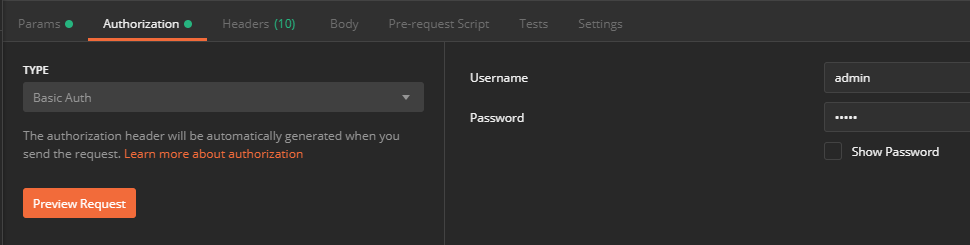
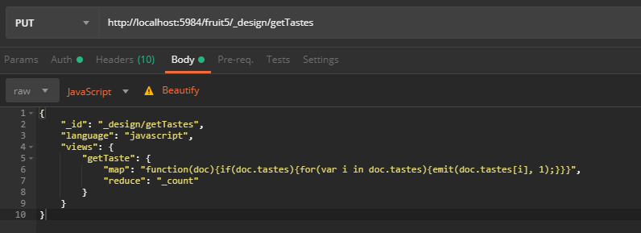

# Postman

## Database

> werkt hetzelfde als files, vandaar enkel een get-voorbeeld:

## Files

> sidenote: soms kan het belangrijk zijn om ingelogd te zijn: dit zijn de credentials van je fauxton (couchdb), zoals bijvoorbeeld username 'admin', password 'admin':

### Get

### Put

> Initial: aanmaken van het object: zonder "_rev"

> De eerste keer is het niet nodig om er "_rev" bij te zetten. Dit wordt automatisch gegenereerd.

> Wijziging wanneer het object al bestaat: met "_rev"

### Delete

## Views

### Get

### Put

> Initial: aanmaken van het object: zonder "_rev"

> Wijzigen: met "_rev" zoals bij een file

### Delete

