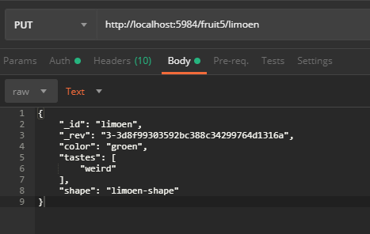
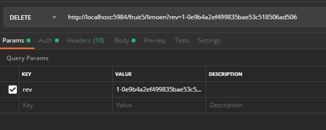

# Postman

## Get

## Put

> Initial: aanmaken

> Wijziging wanneer het object al bestaat:

> Bij de eerste keer is het niet nodig om een "_rev" bij te zetten. Dit wordt automatisch gegenereerd.

## Delete

