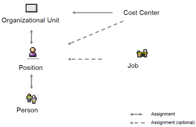

# HCM (Human Capital Management)
## HCM Organizational Structure
- Organisatie van het personeel binnen een organisatie
- Enterprise Structure
	- Formele en financiële structuur

- Personnel Structure
	- status van een werknemer

- Organizational Plan
	- Functie van een persoon binnen een bedrijf

## HCM Master Data
- Personeelsnummer: unieke ID voor elk personeelslid
	- Manueel of door het systeem aangemaakt
	- Alle data van een werknemer is verkrijgbaar via het personeelsnummer
- Reference personnel number
	- Een werknemer die van job veranderd of meerdere jobs heeft
- Infotypes (time dependent: verhuis, duur van afwezigheid, duur contract …)
	- Type informatie over een personeelslid (voorbeeld: soort afwezigheid, adres ...)
	- 3 manieren om aan te passen, voorbeeld: vakantie
		- Persoon: eigenschappen: vakantie: zetVakantie
		- Afwezigheid: zoek persoon: zetVakantie
		- Vakantie: selecteer persoon: zetVakantie

## HCM Processes
- Organizational Management
	- Analyseer je bedrijf en deel het op in categorieën
	- Bereken nodige personeel en de kost ervan
	- Maak scenario’s en simulaties
- Personnel Administration
	- Aanmaken en beheren van personeelsgegevens
	- Checks: zoek incorrecte data
	- Opslag: geschiedenis wordt automatisch bijgehouden (voor bv rapporten)
## HCM Recruitment
- Recruiting (internal & external)
- Beheer database voor sollicitaties
- Beheer vrije posities binnen het bedrijf

- Organizational Assignment
	- Group: Actieve werknemers, Non-actieve werknemers, studenten …
	- Range: Arbeider, bediende, specialist

- Recruitment Process:
> Vrije werkgelegenheid -> Advertentie -> sollicitatie/aanbieding -> Selectie -> Aannemen

- Selectie: 
    - Global: algemene sollicitatie
    - Per werkgelegenheid

## Personnel development
- Extra training nodig of perfecte match?
- Talent management, training/event management, performance management
- Qualifications toekennen (+ geldigheidsduur)

- Qualifications catalog

- Requirements
    - Worden toegevoegd aan posities binnen het bedrijf
    - Zijn kwaliteiten, kennis en ervaring

- Profile matchup
    - Maakt het mogelijk om personen met posities en jobs te vergelijken op basis van requirements en qualifications
    > R = Q -> OK , R < Q -> OK , R > Q -> NOK
## Talent management
- Carrière voorstellen en plannen
- Maak nieuwe jobs “stations”, maak requirements per “station”
- Voorbeeld: 
> Security Guard -> Security Manager -> Chief Security Manager

- Succession planning
	- Zorg voor doorgroeimogelijkheden naar key-positions
	- Zoek naar opvolgers voor key-positions

- Development planning
	- summarizing teaching and education to achieve qualifications
	- deelnemen aan lessen/cursussen

## Performance management
- evaluate employees + hoe gaan ze om met doelstellingen
- adjust bonuses
- GOAL: +motivation +benefits

- Status: In preparation, in process, completed, approved, rejected
- Appraisal template
	- formules, criteria (gegroepeerd) en qualifications
## Personnel controlling
- Standard rapports
	- standaard data: bv geboortedatum zodat je er een lijst van kan opvragen

- Human Resource Information System (HIS), Ad-hoc queries
	- maakt analyse mogelijk

- Business Warehouse: SAP BI -> Weergeven van ‘historische’ data voor analyse

- Employee Self-Service (ESS): systeem waar werknemers hun eigen data moeten updaten
(denk aan uren ingeven, vakantie aanvragen, agenda, vervoerskosten, parkeertickets ingeven, maar ook persoonlijke gegevens zoals adres, telefoonnummer, bankgegevens ...)

- Manager Self-Service (MSS): systeem voor de manager met data van HR en financiën om zo informatie op te vragen, mensen aan te nemen, planningen maken, kosten beheren…
## S/4HANA
- Successfactors: next Gen HCM-suite in de Cloud (tov ECM on premise)
- S/4HANA kan ERP HCM gebruiken
- Variable options Cloud/On Premise
	- executions in cloud, on premise or hybrid
- Fiori interfaces for HCM aren’t planned
- Business Partners: each employee has a BP assigned
