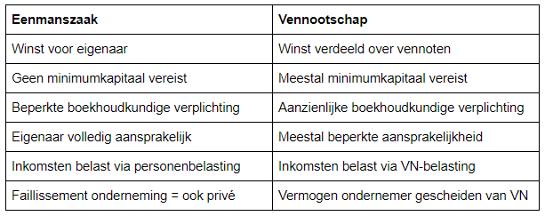

# PPT 1
Waarom Bedrijfsbeleid

-  Je gaat werken in een bedrijf
-  Zelfstandige worden
-  Een bedrijf oprichten
-  Je gaat samenwerken met andere
	- Klanten
	- Leveranciers
	- Consulting

bedrijf = organisatie van mensen en middelen
- die samenwerken om goederen en/of diensten te produceren
- die toegevoegde waarde creëren voor de stakeholders
- met winstoogmerk om de continuïteit te verzekeren

Productiefactoren → vergoeding
- Kapitaal
- Human resources
- Technologie
- Intellectuele eigendom
- Grondstoffen

Stakeholders → meerwaarde
- Aandeelhouders
- Werknemers
- Klanten
- Leveranciers
- Overheid

Winstoogmerk → kosten baten analyse

Missie → visie → strategie → uitvoering → rapportering

- Missie: Wat willen we bereiken
- Visie: Hoe willen we dat bereiken
- Strategie: Op welke manier gaan we dat bereiken
- Uitvoering: Hoe bereiken we dat 
- Rapportering: Hoe hebben we het bereikt

Bedrijf: motor van maatschappelijke vooruitgang en welvaart door toegevoegde waarde te creëren

Winst = Inkomsten – Uitgaven

#### Juridische entiteit:

Rechtspersoon
- Heeft rechten en plichten
- Heeft bezittingen en schulden
- Is onderworpen aan de wet
- Kan contracten afsluiten
- Kan handelingen stellen
- …

≠ De eigenaar, manager, werknemer

#### Ondernemingsvorm:

Keuze afhankelijk van
- Marktsituatie
- Aantal vennoten
- Vereist kapitaal
- Aansprakelijkheid
- …

Vorm kan wijzigen wanneer context wijzigt
- Groei
- Internationalisering
- Overnames

#### Vennootschappen:

Voorbeelden
- NV Naamloze vennootschap
- BVBA Besloten vennootschap met beperkte aansprakelijkheid
- CV Coöperatieve vennootschap
- VZW Vereniging zonder winstoogmerk

#### Sectoren:

- Primaire sector
  - Agrarische activiteiten
- Secundaire sector
  - Verwerken van grondstoffen en halffabricaten
- Tertiare sector
  - Verstrekken van diensten
- Quartaire sector
  - Maatschappelijke dienstverlening

#### Boekhoudkundige entiteit:
Kleine onderneming < middelgrote entiteit < grote onderneming

→ afhankelijk van:
Aantal werknemers
Omzet
Balanstotaal

Verschillende boekhoudkundige verplichtingen

Marktstructuur: 
- Volkomen mededinging:
	- Veel aanbieders, veel afnemers
- Monopolie:
	- 1 aanbieder, veel afnemers
- Monopsonie:
  - Veel aanbieders, 1 afnemer
- Oligopolie:
	- Enkele aanbieders, veel afnemers

#### Strategie:
Productdifferentiatie
- Beter product of dienst, niet prijs afhankelijk

Cost leadership
- Vergelijkbaar product aan lagere kosten

Niche strategie
- Gericht op specifiek markt deel, aangepast product

Innovatie
- Nieuw product


#### Ondernemingsplan: 
illustreert de haalbaarheid van de onderneming met cijfers
- Nodig voor het aantrekken van kapitaal, krediet, medewerkers en zakenpartners 
- Soms nodig voor oprichting of beperken van aansprakelijkheid
- Bevat 
  - missie, doel en strategie van de onderneming
  - omgevingsanalyse
  - marktanalyse
  - bedrijfsorganisatie
  - financieel plan
