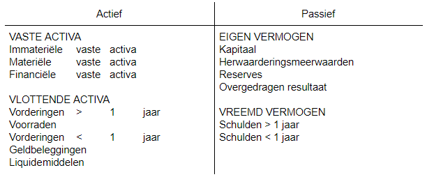
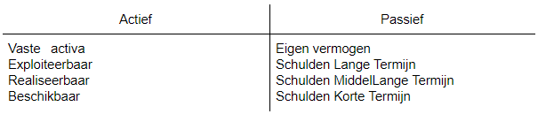
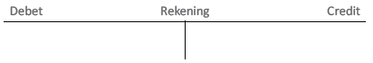
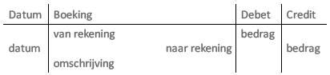

# PPT 2
#### Algemene Boekhouding:
- Balans (momentopname)
- ResultatenRekening (kosten baten analyse)

→ Externe Verslaggeving

#### Analytische boekhouding:
- Kostprijssystemen
- Budgettering/kostenbeheer
- Management accounting

→ Interne verslaggeving op basis van kosten baten analyse

#### Enkelvoudige boekhouding:
- Inkoopdagboek
- Verkoopdagboek
- Financieel dagboek
- Inventarisboek

#### Dubbele boekhouding:
Vermogen van onderneming, niet eigenaars

Bedrijf bezit niets zonder financiering

Iedere verrichting → dubbele boeking
- Oorsprong middelen
- Aanwending middelen

## Balans: 
_momentopname toestand vd onderneming_

Actief en passief in evenwicht → elke transactie dubbele boeking

#### Verrichtingen: 
bezittingen, vorderingen, schulden aan eigenaars of schulden aan derden: interne waardeverschuiving of waardeomzetting

→ actief = passief: balans altijd in evenwicht

→ Verhouding balans op korte, middellange en lange termijn

→ Waardering houdt rekening met afschrijvingen en waardeverminderingen

→ Overlopende rekeningen voor
- Betaalde maar niet gemaakte kosten (en omgekeerd)
- Verworven maar niet ontvangen opbrengsten (en omgekeerd)

## Resultatenrekening: 
_winst of verlies gedurende bepaalde periode_

→ balans van kosten en opbrengsten Voilà

#### Boekhouding: 
_opeenvolgende balansen per verrichting_

→ grootboek en journaal
- Grootboek met rekeningen voor elk bestanddeel van
  - Activa
  - Passiva
  - Kosten
  - Opbrengsten
- Journaal
  - Chronologische log van verrichtingen
- Consolideren voor momentopname balans en resultaat

#### Rekening: 

#### Journaal: 

#### Jaarrekening:
Consolidate journaal en grootboek
- balans en resultatenrekening
- Momentopname
- Periodiek
- Verplicht
- Volgens vastgelegd stelsel
- Publiek beschikbaar
- Analyseerbaar

#### Kosten:
- Indeling in categorieën volgens aard
  - Kostensoorten
- Indeling volgens afhankelijkheid outputvolume
  - Vaste kosten
  - Variabele kosten
- Indeling volgens toewijsbaarheid aan output
  - Directe kosten
  - Indirecte kosten

#### Afschrijvingen:
- Tijdsverschil tussen uitgaven en toewijzing kosten
- Geleidelijke verrekening van de investeringskosten
- Compensatie voor de waardevermindering
- Impact op resultaat en belastingen
- Vastgelegde maximumgrenzen
- Kan leiden tot parallelle boekhoudingen, fiscale (extern) en industriële (intern)
- Afschrijvingsbedrag afhankelijk van:
  - Investeringskost
  - Restwaarde
  - Afschrijvingsperiode
  - Afschrijvingsmethode
