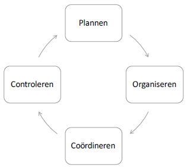

# PPT 5
#### Management:
- Vanuit de doelstellingen van de organisatie, het coördineren van de werkzaamheden zodat deze door de werknemers door de werknemers uitgevoerd worden op efficiënte en effectieve wijze
- op verschillende niveaus binnen de organisatie, van strategisch tot uitgevoerd
- Efficiëntie
  - Gebruik van middelen
  - Zo weinig mogelijk verspilling
  - Activiteiten op de juiste manier doen
- Effectiviteit
  - Realisatie van doelstellingen
  - Zo veel mogelijk resultaten
  - De juiste activiteiten doen

→ Management streeft naar een maximale realisatie van de bedrijfsdoelstellingen met een minimaal verlies van bronnen

#### Managementproces:

#### Plannen:
- opstellen en formuleren van doelstellingen op strategisch, tactisch en uitvoerend niveau
- Ontwikkelen van strategieën voor de realisatie van doelstellingen
- Ontwikkelen van plannen voor de coördinatie en controle van de realisatie
- Budgetteren

#### Organiseren:
- opstellen van taken die uitgevoerd moeten worden
- organisatiestructuur en -cultuur beheren
- verdelen van taken, bevoegdheden, verantwoordelijkheden, budgetten

#### Coördineren:
- aansturen en motiveren van werknemers
- opstellen van communicatiekanalen
- opstellen van procedures, instructies
- afstemmen van verschillende processen, afdelingen
- oplossen van conflicten

#### Controleren:
- Vaststellen van de prestaties
- Vergelijking van de prestaties met de doelstellingen
- Opvolgen of procedures en instructies correct gevolgd worden
- Controleren van de nauwkeurigheid en betrouwbaarheid van de rapportering

#### Operationeel Management:
- beslissingen op basis van KB-analyse
- kostenbeheer
- budgetbeheer

#### Kostenbeheer:
- Ter ondersteuning van beleidsbeslissingen
- Kostprijssystemen
  - Kosten toewijzen aan producten of diensten
    - Full Costing
    - Direct Costing
  - Kosten toewijzen aan activiteiten
    - Activity based Costing
  - Kosten plannen voor productontwikkeling
    - Target Costing
  
#### Activity Based Costing:
- toenemend belang van materiaalkosten en overheadkosten
- Traditionele kostprijssystemen voldoen vaak niet meer aan de informatiebehoeften van het management
- van werkefficiëntie naar kostenefficiëntie 
- overhead zoveel mogelijk beperken
- voorraden beperken: JIT: just in time leveren

#### Target Costing:
- Van achteraf controleren en bijsturen van kosten van bepaalde producten / productiemethoden → naar op voorhand plannen en reduceren van kosten van nieuwe producten / productiemethoden
- Van beste prijs voor een bepaald product naar beste product voor bepaalde prijs

#### BudgetBeheer:
- Begroting 
  - (= vertaling van doelstellingen en plannen naar concrete cijfers)
  - (= schatting van te realiseren inkomsten en uitgaven)
- Beheersinstrument in de sturing van de bedrijfsvoering en het realiseren van doelstellingen
- Plannen
  - Uitdrukking van doelstellingen in cijfers
  - Toetsing van de haalbaarheid van de doelstellingen
- Organiseren en coördineren
  - Deelbudgetten toekennen aan afdelingen
  - Beslissingsvrijheid binnen bevoegdheden en budget
- Controleren
  - Toetsen resultaten aan begroting
  - Bijsturen budgetten
  - Management by exception
