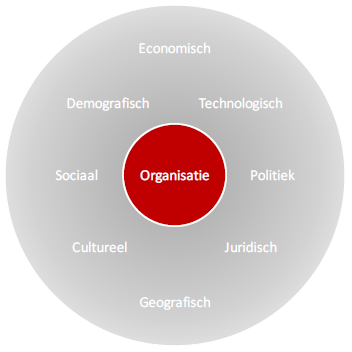

# PPT 6
#### Professionele omgeving:
- Bedrijfsketen
- Stakeholders
- Integratievormen

#### Bedrijfsketen:
- Verticale Integratie
  - Achterwaartse integratie → Leveranciers
  - Voorwaartse integratie → Klanten
- Horizontale integratie	→ Concullega’s

#### IntegratieVormen:
- Verticaal en horizontaal
- geheel, gedeeltelijk of niet
- Graad van controle, betrokkenheid
- Van volledig uitbesteden tot volledig zelf doen
- Activiteiten, producten, diensten, afdelingen
- Productie, verpakking, distributie, onderhoud, marketing
- Uitbesteding
- Samenwerking
- Participatie
- Overname
- Holding

#### Externe Omgeving:

