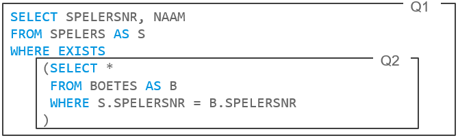

# PPT1
Toevoeging: `<>` betekent hetzelfde als `!=`

### BETWEEN

```sql
SELECT
	WEDSTRIJDNR
FROM
	WEDSTRIJDEN
WHERE
	GEWONNEN + VERLOREN BETWEEN 2 AND 4
;
```
> GEWONNEN + VERLOREN geeft een variabele integer. Enkel wanneer deze som tussen de constante 2 en constante 4 uitkomt (2 en 4 inbegrepen) wordt de wedstrijdnummer behouden in het resultaat. 

### LIKE

```sql
SELECT
	NAAM, SPELERSNR
FROM
	SPELERS
WHERE
	NAAM LIKE ‘B%’
;
```
> % → Wanneer de NAAM van een speler begint met ‘B’ en gevolgd wordt door 0 of meerdere willekeurige karakters, wordt de speler zijn NAAM en SPELERSNR behouden in het resultaat.

```sql
SELECT
	NAAM, SPELERSNR
FROM
	SPELERS
WHERE
	NAAM LIKE ‘B_’
;
```
> _ → Wanneer de NAAM van een speler begint met ‘B’ en gevolgd wordt door precies 1 willekeurig karakter, wordt de speler zijn NAAM en SPELERSNR behouden in het resultaat.


### IS NULL

```sql
SELECT
	*
FROM
	SPELERS
WHERE
	BONDSNR IS (NOT) NULL
;
```
> BONDSNR IS NULL: geeft alles weer van de spelers waarvan er geen bondsnummer bestaat.

> BONDSNR IS NOT NULL: geeft alles weer van de spelers waarvan er wél een bondsnummer bestaat.

### EXISTS

```sql
SELECT
	NAAM
FROM
	SPELERS AS S
WHERE
	EXISTS
	(
		SELECT * FROM BOETES AS B
    		WHERE B.SPELERSNR = S.SPELERSNR
	)
;
```
> Men selecteert kolom NAAM van SPELERS (alias S) en maakt hier een tussenresultaat van. Van dit tussenresultaat wordt er spelersnr per spelersnr bekeken of er een boete voor bestaat (EXISTS). Indien ja (TRUE), wordt deze rij weerhouden, en zal de naam weergegeven worden.

### ALL (and)

```sql
SELECT
	SPELERSNR, NAAM, GEB_DATUM
FROM
	SPELERS
WHERE
	GEB_DATUM <= ALL (SELECT GEB_DATUM FROM SPELERS)
;
```

→ Geeft de spelers met de kleinst voorkomende geboortedatum weer

> GEB_DATUM mag niet NULL zijn, want dan is het antwoord onbekend

> als GEB_DATUM niet NULL is en ALL geen resultaat geeft, is het antwoord TRUE

> als ALL<sub>x</sub> niet NULL is en ALL<sub>x+1</sub> wel NULL, is het antwoord FALSE

### ANY (or)

```sql
SELECT
	SPELERSNR, NAAM, GEB_DATUM
FROM
	SPELERS
WHERE
	GEB_DATUM > ANY (SELECT GEB_DATUM FROM SPELERS)
;
```

→ Geeft alle spelers terug, behalve diegene waarvan zijn geboortedatum het kleinste is. (want, de meegegeven geboortedatum moet groter zijn dan eender welke andere geboortedatum (zie subquery). Voor alle geboortedatums behalve de kleinste zal dit true weergeven. Want, de kleinste is niet groter dan eender welke andere geboortedatum. Deze zal dus niet weerhouden worden, al de rest wel.

> GEB_DATUM mag niet NULL zijn want dan is het antwoord onbekend

> als GEB_DATUM niet NULL is en ANY geen resultaat geeft, is het antwoord FALSE

### NOT

> Voorbeeld 1:
```sql
WHERE
	PLAATS = ‘Den Haag’
;
```

→ 

```sql
WHERE
	NOT (PLAATS = ‘Den Haag’)
;
```
> Voorbeeld 2:

> Volgende statement zal niet werken omdat SPELERSNR geen sleutel is in tabel BOETES.
```sql
SELECT
	SPELERSNR
FROM
	BOETES 
WHERE
	NOT(BEDRAG = 25)
;
```

> Om toch het resultaat te verkrijgen, werken we via een tabel waar SPELERSNR wél een sleutel is, bijvoorbeeld tabel SPELERS.

```sql
SELECT
	SPELERSNR
FROM
	SPELERS
WHERE
	SPELERSNR NOT IN
	(
		SELECT SPELERSNR FROM BOETES WHERE BEDRAG = 25
	)
;
```

### Reikwijdte van kolom bij subquery’s



> Q2 maakt gebruik van de tabel SPELERS (alias S) uit Q1. Dit maakt van Q2 een gecorreleerde subquery. Gebruik in zulke gevallen altijd aliases voor kolomnamen, dit maakt het veel overzichtelijker.

> Q1 haalt kolommen SPELERSNR en NAAM uit tabel SPELERS, en steekt dit in een tussenresultaat.

> Q2 kijkt voor elk SPELERSNR in het tussenresultaat of dit voorkomt in kolom SPELERSNR van tabel BOETES (dit betekent zoveel als: kijk voor elke spelersnummer in het tussenresultaat of die een boete heeft gehad). Wanneer dit het geval is, wordt de spelersnummer weerhouden in het eindresultaat. Zoniet, wordt de spelersnummer niet weerhouden. Zo krijgt men uiteindelijk een lijst van spelersnummers en namen van alle spelers met een boete.


