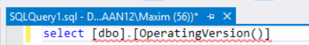
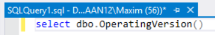
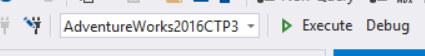

# DPA
## Het grote "ik doe niks verkeerd maar da werkt hier ni"-kennissysteem
### Deel 6
#### WAAROM KAN IK MIJN ZELFGESCHREVEN FUNCTIE NIET SELECTEREN?

Als je `select` typt en vervolgens de gewenste function uit de Object Explorer naar het query-venster sleept, dan zie je een rood lijntje. Om dit op te lossen doe je gewoon de vierkante haakjes weg.

In het geval dat de het rode lijntje blijft staan, probeer je de query waarschijnlijk op een andere databank dan `AdventureWorks2016CTP3` uit te voeren. Je kan dit veranderen in de combobox links van de Execute-knop.

