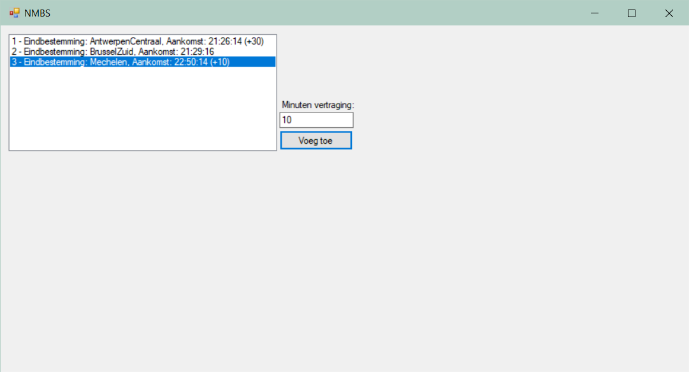
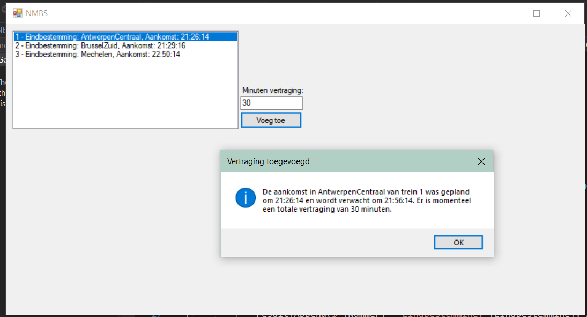

# Les 2
## Oefening 1




### Klasse Form1
```csharp
public partial class Form1 : Form
{
    List<Trein> treinen;
    public Form1()
    {
        InitializeComponent();
        treinen = new List<Trein>
        {
            new Trein(1, Eindbestemmingen.AntwerpenCentraal, new DateTime(2019, 4, 9, 21, 26, 14)),
            new Trein(2, Eindbestemmingen.BrusselZuid, new DateTime(2019, 4, 9, 21, 29, 16)),
            new Trein(3, Eindbestemmingen.Mechelen, new DateTime(2019, 4, 9, 22, 50, 14))
        };
        listBoxTreinen.DataSource = treinen;
    }

    private void ButtonVertragingToevoegen_Click(object sender, EventArgs e)
    {
        Trein geselecteerdeTrein = (Trein)listBoxTreinen.SelectedItem;
        geselecteerdeTrein.Vertraging += int.Parse(textBoxVertraging.Text);
        MessageBox.Show($"De aankomst in {geselecteerdeTrein.Eindbestemming} van trein {geselecteerdeTrein.Nummer} was gepland om {geselecteerdeTrein.Aankomst.ToLongTimeString()} en wordt verwacht om {geselecteerdeTrein.Aankomst.AddMinutes(geselecteerdeTrein.Vertraging).ToLongTimeString()}. Er is momenteel een totale vertraging van {geselecteerdeTrein.Vertraging} minuten.", "Vertraging toegevoegd", MessageBoxButtons.OK, MessageBoxIcon.Information);
        listBoxTreinen.DataSource = null;
        listBoxTreinen.DataSource = treinen;
    }
}
```
### Klasse Trein
```csharp
enum Eindbestemmingen { BrusselZuid, AntwerpenCentraal, Mechelen}
    class Trein
    {
        public int Nummer { get; }
        public Eindbestemmingen Eindbestemming { get; }
        public DateTime Aankomst { get; }
        public int Vertraging { get; set; }

        public Trein(int nummer, Eindbestemmingen eindbestemming, DateTime aankomst)
        {
            Nummer = nummer;
            Eindbestemming = eindbestemming;
            Aankomst = aankomst;
        }

        public override string ToString()
        {
            StringBuilder result = new StringBuilder();
            result.Append($"{Nummer} - Eindbestemming: {Eindbestemming}, Aankomst: {Aankomst.ToLongTimeString()}");
            if (Vertraging > 0)
                result.Append($" (+{Vertraging:00})");
            return result.ToString();
        }
    }
```
## Oefening 2

### Klasse Form1
```csharp
public partial class Form1 : Form
{
    List<Trein> treinen;
    public Form1()
    {
        InitializeComponent();
        treinen = new List<Trein>
        {
            new Passagierstrein(1, Eindbestemmingen.AntwerpenCentraal, new DateTime(2019, 4, 9, 21, 26, 14), 1200),
            new Goederentrein(2, Eindbestemmingen.BrusselZuid, new DateTime(2019, 4, 9, 21, 29, 16), 100000, 140000, true),
            new Passagierstrein(3, Eindbestemmingen.Mechelen, new DateTime(2019, 4, 9, 22, 50, 14), 400)
        };
        listBoxTreinen.DataSource = treinen;
    }

    private void ButtonVertragingToevoegen_Click(object sender, EventArgs e)
    {
        Trein geselecteerdeTrein = (Trein)listBoxTreinen.SelectedItem;
        geselecteerdeTrein.VoegVertragingToe(int.Parse(textBoxVertraging.Text));
        MessageBox.Show($"De aankomst in {geselecteerdeTrein.Eindbestemming} van trein {geselecteerdeTrein.Nummer} was gepland om {geselecteerdeTrein.Aankomst.ToLongTimeString()} en wordt verwacht om {geselecteerdeTrein.Aankomst.AddMinutes(geselecteerdeTrein.Vertraging).ToLongTimeString()}. Er is momenteel een totale vertraging van {geselecteerdeTrein.Vertraging} minuten.", "Vertraging toegevoegd", MessageBoxButtons.OK, MessageBoxIcon.Information);
        listBoxTreinen.DataSource = null;
        listBoxTreinen.DataSource = treinen;
    }

    private void ListBoxTreinen_SelectedIndexChanged(object sender, EventArgs e)
    {
        if (listBoxTreinen.SelectedItem is Goederentrein trein) //Het alternatief 'listBoxTreinen.SelectedItem.GetType() == typeof(Goederentrein)' zorgt er hier voor dat de datasource niet opnieuw kan worden ingesteld (om de vertragingen weer te geven), zelf heb ik geen idee waarom.
        { //Nog een voordeel aan het 'is'-keyword is dat je meteen een referentie kan aanmaken, wat de gecommente code op het lijntje hieronder overbodig maakt.
            //Goederentrein trein = (Goederentrein)listBoxTreinen.SelectedItem;
            labelInfoGoederenTrein.Text = $"Brutogewicht: {trein.BrutoGewicht}\nNettogewicht: {trein.NettoGewicht}\nTarragewicht: {trein.BerekenTarraGewicht()}";
        }
        else
            labelInfoGoederenTrein.ResetText();
    }
}
```
### Klasse Trein
```csharp
enum Eindbestemmingen { BrusselZuid, AntwerpenCentraal, Mechelen}
class Trein
{
    public int Nummer { get; }
    public Eindbestemmingen Eindbestemming { get; }
    public DateTime Aankomst { get; }
    public double Vertraging { get; private set; }

    public Trein(int nummer, Eindbestemmingen eindbestemming, DateTime aankomst)
    {
        Nummer = nummer;
        Eindbestemming = eindbestemming;
        Aankomst = aankomst;
    }

    public virtual void VoegVertragingToe(double minuten)
    {
        Vertraging += minuten;
    }

    public override string ToString()
    {
        StringBuilder result = new StringBuilder();
        result.Append($"{Nummer} - Eindbestemming: {Eindbestemming}, Aankomst: {Aankomst.ToLongTimeString()}");
        if (Vertraging > 0)
            result.Append($" (+{Vertraging:00})");
        return result.ToString();
    }
}
```
### Klasse Passagierstrein
```csharp
class Passagierstrein : Trein
{
    public int PassagiersCapaciteit { get; }
    public Passagierstrein(int nummer, Eindbestemmingen eindbestemming, DateTime aankomst, int passagiersCapaciteit) : base(nummer, eindbestemming, aankomst)
    {
        PassagiersCapaciteit = passagiersCapaciteit;
    }

    public override string ToString()
    {
        return $"Passagierstrein (limiet: {PassagiersCapaciteit}) " + base.ToString();
    }
}
```
### Klasse Goederentrein
```csharp
class Goederentrein : Trein
{
    public int BrutoGewicht { get; set; }
    public int NettoGewicht { get; set; }
    public bool VervoertGevaarlijkeProducten { get; set; }
    public Goederentrein(int nummer, Eindbestemmingen eindbestemming, DateTime aankomst, int brutoGewicht, int nettoGewicht, bool vervoertGevaarlijkeProducten) : base(nummer, eindbestemming, aankomst)
    {
        BrutoGewicht = brutoGewicht;
        NettoGewicht = nettoGewicht;
        VervoertGevaarlijkeProducten = vervoertGevaarlijkeProducten;
    }

    public override void VoegVertragingToe(double minuten)
    {
        if (VervoertGevaarlijkeProducten)
            base.VoegVertragingToe(minuten * 1.2);
        else //moet omdat we niets returnen --> de methode wordt dus niet beëindigd op het vorige lijntje. Indien we geen else zouden zetten, zou de vertraging twee keer worden toegevoegd.
            base.VoegVertragingToe(minuten);
    }

    public int BerekenTarraGewicht()
    {
        return NettoGewicht - BrutoGewicht;
    }

    public override string ToString()
    {
        string vervoertGevaarlijkeProducten = VervoertGevaarlijkeProducten ? "(vervoert gevaarlijke producten)" : "(vervoert geen gevaarlijke producten)";
        //Conditional variable, meer info hier: https://docs.microsoft.com/en-us/dotnet/csharp/language-reference/operators/conditional-operator

        return $"Goederentrein {vervoertGevaarlijkeProducten} " + base.ToString();
    }
}
```
