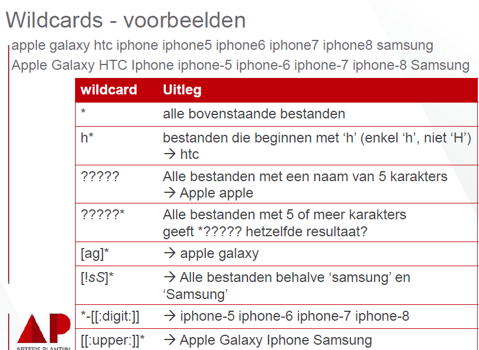

# Deel 2
## Terminal: basics

**(gebruikersnaam)**@**(machinenaam)**:~$

-	gebruikersnaam
-	@
-	machinenaam
-	:
-	~ (staat voor de home-directory van de user)
-	$ (betekent dat er input van de user verwacht wordt (een commando))

**(commando)**_(-optie’s’)_**(argumenten)**

-	commando (commandonaam)
-	opties (om info te krijgen of iets extra vragen)
-	argumenten (bijvoorbeeld een bestandsnaam)

-	Variabelen bekijken
o	**echo $PATH** laat u de inhoud van het $PATH zien
o	**echo (var)** laat u de inhoud van (var) zien
-	Navigeren in directories
o	**cd.** gaat naar de huidige directory
o	**cd..** gaat naar de vorige (parent-) directory
o	**cd map1/map2/map3** gaat naar map3 in map2 in map1
o	**cd /** gaat naar root-directory
-	Wildcards: voorbeelden (zelf af te leiden, super easy)

 

-	**cp (item)** maakt een copy van (item)
-	**mv (item)** verplaats/hernoem (item)
-	**mkdir (naam)** maakt een directory aan met de naam (naam)
-	**rm (item)** verwijderd het bestand (item)
-	**rmdir (item)** verwijderd de directory (item)

-	**(commando)** _--help_ geeft een hulppagina voor het (commando) 
