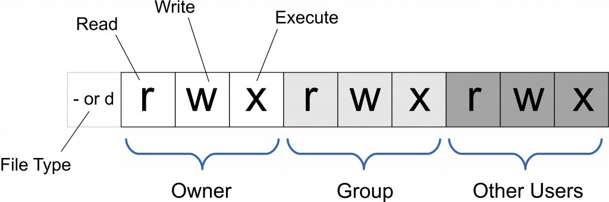
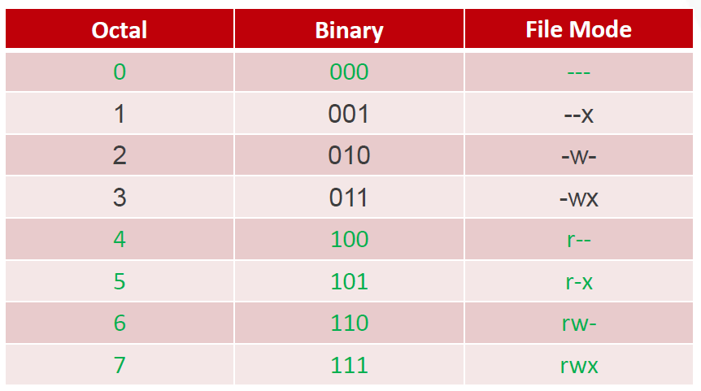
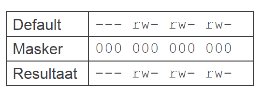

# Deel 4
## Accounts/Gebruikers in Linux
>Onthoud de mappen /etc/passwd en /etc/shadow

>In de map shadow kan je zien welke gebruikers een wachtwoord hebben en wat de staat ervan is. “NP” of “!” = geen paswoord; “LK” of “*” = account gelocked; “!!” = paswoord is vervallen

>Voor bijna alle commando’s zal je **sudo** moeten gebruiken als je niet als root bent aangemeld!
*	Account maken
    *	**sudo useradd (name)** maakt een account met de naam (name) (paswoord pas achteraf ingeven)
    *	**useradd -m (name)** maakt een account met de naam (name) en maakt ook ineens een home-directory aan. (paswoord pas achteraf ingeven)
    *	**adduser (name)** maakt een nieuw account met de naam (name) en zal ook meteen het paswoord willen instellen.
    *	**whoami** geeft weer met welk account je bent aangemeld

*	Paswoord maken
    *	**passwd (name)** stelt het paswoord in voor het account (name). Handig om te gebruiken na useradd.

*	Account switchen
    *	**su (name)** switcht naar het account (name). Als je (name) weglaat switch je naar root. 

*	Account locken
    *	**usermod -L (name)** zal het account (name) locken. (hoofdletter L)
    *	**passwd -l (name)** zal het account (name) locken. (kleine letter l)

*	Account unlocken
    *	**usermod -U (name)** zal het account (name) unlocken. (hoofdletter U)
    *	**passwd -u (name)** zal het account (name) unlocken. (kleine letter u)

*	Account deactiveren
    *	**usermod -e (1 of datum) (name)** zal het account (name) deactiveren. Je kan kiezen voor parameter 1, die deactiveert het account tot jij het weer activeert, of je zet een bepaalde datum waarop het account automatisch weer geactiveerd wordt.

*	Account terug activeren
    *	**usermod -e (-1 of date) (name)** zal het account (name) activeren. Je kan kiezen voor parameter -1, die activeert het account tot jij het weer deactiveert, of je zet een bepaalde datum waarop het account automatisch weer gedeactiveerd wordt.

*	Account verwijderen
    *	**userdel (name)** verwijdert het account (name)
    *	**userdel -r (name)** verwijdert het account (name) en zijn home-directory
## Groepen in Linux
> Bij het aanmaken van een account (name) zal het ook automatisch aan de primaire groep (name) toegevoegd worden. Deze groep heeft dus dezelfde naam als het account. 

*	Groepen tonen
    *	**groups (name)** toont in welke groepen het account (name) zit.
    *	**groups zonder (name)** geeft weer in welke groepen het aangemelde account zich bevindt.
*	Groepen maken
    *	**groupadd (groupname)** maakt de groep (groupname) aan.

*	Groepen verwijderen
    *	**groupdel (groupname)** verwijderd de groep (groupname)

*	Account aanmaken en meteen aan groepen toevoegen
    *	**useradd -g (groupname) (name)** zal het account (name) maken en meteen aan de groep (groupname) toevoegen. (kleine letter g)
    *	**useradd -G (groupname1),(groupname2),(groupname…) (name)** zal het account (name) aanmaken en het meteen toevoegen aan alle (groupname…) die zijn megegeven na -G. (hoofdletter G)
*	Reeds bestaand account toevoegen aan groepen
    *	**usermod -aG (groupname…) (name)** voegt het account (name) toe aan de groepen (groupname…). (kleine letter a, hoofdletter G)

*	Account verwijderen uit een groep
    *	**deluser (name) (groupname)** verwijderd het lidmaatschap van het account (name) in de groep (groupname)
    *	**gpasswd -d (name) (groupname)** verwijderd het lidmaatschap van het account (name) in de groep (groupname)

## Security / Permissions in Linux

 
 
*	**‘-‘** wordt gebruikt als het een bestand is, **‘d’** wordt gebruikt als het een folder is. 
*	**read**: leesrechten, write: schrijfrechten, execute: uitvoerrechten
*	**owner**: eigenaar die de map of het bestand gemaakt heeft, group: de groep waarmee de owner de map of het bestand gedeeld heeft, world: alle andere gebruikers die er bestaan
wanneer een attribuut niet is ingesteld (iemand heeft de rechten NIET) dan wordt de letter **‘r’,’w’ of ’x’** vervangen door een **‘-‘**. Zo krijgt men bv: **r-x r-x r-x** (waarbij iedereen het bestand kan bekijken en uitvoeren maar niemand het bestand kan bewerken, want de letter **‘w’** is overal weggelaten)
om snel rechten toe te kennen gebruiken we de letter **‘u’ voor owner (u van user)**, **‘g’ voor group** en **‘o’ voor world (o van others)**. Rechten toekennen doen we met **‘+’**, rechten afnemen doen we met **‘-‘**

>We kunnen ook octale getallen gebruiken om rechten toe te kennen.
>Vb: **chmod 555 (item)** waarin 555 drie octale getallen zijn zal binair chmod 101101101 (item) betekenen en dus r-xr-xr-x rechten toekennen op het bestand (item)
*	rechten veranderen
    *	**chmod +rx (item)** zal iedereen ‘rx’ rechten toekennen voor het bestand (item).
    *	**chmod -w (item)** zal iedereen ‘w’ rechten afnemen voor het bestand (item) 
    *	**chmod 555 (item)** zal iedereen ‘r-x’ rechten geven.

* **umask**: commando om defaultpermissies af te nemen. Bestaat uit 4 octale getallen waarbij 0 niets veranderd. 

*	Default permissies afnemen
    *	**umask 0002 (item)** zal de rechten op (item) van rw-rw-rw- veranderen naar rw-rw-r-- omdat het laatste getal een octale 2 is en dat komt overeen met binair 010 en dat staat voor write-rechten. Deze zullen dan afgenomen worden. De eerste getallen zijn 0 en zullen dus niets veranderen.
