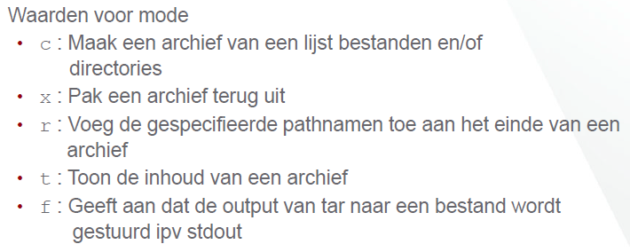

# Deel 6
## compressie: GZIP
**Gzip** _(-options)_ **(files)** (vb: gzip bestand.txt)
*	bestanden zippen
    *	**gzip (item)** zal het (item) zippen
    *	**gzip** _-tv_ **(item)** zal de inhoud van het gezipte bestand tonen

*	bestanden unzippen
    *	**gzip** _-d_ **(item)** zal het (item) unzippen
    *	**gunzip (item)** zal het (item) unzippen

*	archiveren
    *	**tar _(mode)_** _(-options)_ **(pathname)** zal de (mode) uitvoeren op het bestand waar (pathname) naar verwijst.

    *	**tar _tf_ (item.tar)** laat de inhoud van het archief (item.tar) zien
    *	**tar _tvf_ (item.tar)** laat de inhoud van het archief (item.tar) gedetailleerd zien
    *	**tar _xf_ (item.tar) (pathname)** haalt een enkel bestand waar (pathname) naar verwijst terug uit het archief (item.tar)
    *	_--wildcards_ (optie) zorgt ervoor dat je wildcards kan gebruiken in een (pathname)
    *	**find (mapnaam)** _-name_ **‘(name)’** zoekt het bestand (name) in de map (mapnaam)
