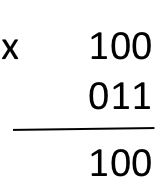

# Hoofdstuk 1
Fractie: waarde tussen 0 en 1 (vb: 0 < 0,59 < 1)

Vlottende komma: scheidingsteken tussen het gehele deel van een getal en fractioneel deel van hetzelfde getal (,)

Kommagetal: geheel deel + vlottende komma + fractioneel deel

Toestandsteken: + (positief) - (negatief)

Additief getal: een waarde uitgedrukt via het bijeentellen van absolute symbolen (zoals getalnotatie van de Romeinen en Maya’s)

Getalbasis: een vast geheel grondtal B>1 om getallen uit te drukken m.b.v. machten

Getal uit een positiestelsel: een waarde uitgedrukt door een cijferpatroon van relatieve cijfers t.o.v. een getalbasis B.

Naargelang zijn positie kan eenzelfde cijfer uit het cijferpatroon een ander gewicht hebben (vb de 1 in 13 heeft een groter gewicht dan de 1 in 21)

Digitaliseren: het uitdrukken van analoge waarden via getallen met een beperkt aantal beduidende cijfers in een positiestelsel (decimaal = 0-9 = getalbasis 10, hexadecimaal = 0-15 = getalbasis 16, binair = 0-1 = getalbasis 2)

Voorloopnullen/Naloopnullen: niet-bijdragende nullen genoteerd voorafgaand/achteraangaand aan het meest beduidende eigenlijke cijfer van het gehele deel van een getal

Mantisse: een waarde tussen 1 en de vaste getalbasis B

Wetenschappelijke getalnotatie: een getal uitgedrukt in een product van 3 factoren

getal = toestandsteken x mantisse x (getalbasis)<sup>exponent</sup>

Decimaal getal: een waarde uitgedrukt in het positiesysteem met vaste getalbasis 10

Notatie: (cijferpatroon)<sub>dec</sub> = (cijferpatroon)<sub>10</sub>

Binair getal: een waarde uitgedrukt in het positiesysteem met vaste getalbasis 2

Notatie: (cijferpatroon)<sub>bin</sub> = (cijferpatroon)<sub>2</sub>
- bit: binary digit, afgekort met ‘b’
- msb: most significant bit
- lsb: least significant bit

benamingen:
- bit = 1 cijfer (0-1)
- nibble = 4 cijfers (0-1)
- byte = 8 cijfers (0-1) 

## Decimaal optellen:
Exact hetzelfde als decimaal optellen.

Voorbeeld:
```
   1 0 1
   0 1 0
 +
   1 1 1
```
Indien we 2 keer een 1 hebben, werken we met de overdracht van een 1.
```
   (1) <-- We schrijven vanonder in het resultaat een 0 en dragen deze 1 over.
  0 0 1
  0 0 1
+
  0 1 0
```
Bij het overdragen van een 1 kunnen we op dezelfde situatie uitkomen. Draag dan gewoon nog een 1 over.
```
   (1) <-- We schrijven vanonder in het resultaat een 0 en dragen deze 1 over.
 (1) <-- Idem
  0 0 1
  0 1 1
+
  1 0 0
```

## Binair vermenigvuldigen
In dit voorbeeld vermenigvuldigen we 4 met 3, in binair 100 met 011.

We starten van rechts naar links vanaf het tweede getal (011). We nemen dus de 1 helemaal rechts van 011 en vermenigvuldigen dit met het eerste getal (100). 1 * 100 is 100.



We doen exact hetzelfde voor de tweede bit van het tweede getal en verkrijgen opnieuw 100. We plaatsen dit resultaat wel 1 bit naar links.


Omdat de derde bit van ons tweede getal gelijk is aan 0, slagen we dit over (0 * 100 = 0) en kunnen we meteen starten aan het [optellen](binair_optellen.md) van onze tussenresultaten. Als je met grotere getallen werkt is het soms echter wel handig om deze nullen te noteren, aangezien dat de optelling achteraf vergemakkelijkt (minder overdrachten van 1).


In het geval dat we met kommagetallen werken, tellen we de het aantal bits achter de komma vanaf de minst beduidende bit bij beide getallen op.
Stel dat we 100,(01 <-- 2 bits achter de komma tot en met de lsb(least significant bit, of laatste 1)) en 11,(1 <-- 1 bit achter de komma tot en met de lsb) optellen geeft dat dat we in ons uiteindelijk resultaat 3 beduidende bits (2+1) achter de komma gaan hebben.
```
          1 0 0, 0 1
            1 1, 1
      x
      1 0 0 0 1       <-- 1 * 10001
    1 0 0 0 1         <-- 1 * 10001
  1 0 0 0 1           <-- 1 * 10001
+
  1 1 1 0 1 1 1

  Toevoeging komma 3 bits vanaf de lsb:

  1 1 1 0,1 1 1
```
## Binair verdubbelen
De binaire verdubbeling is heel simpel. Het enige wat je hoeft te doen is de vlottende komma naar achter verplaatsen.
Het dubbel van (1)<sub>bin</sub> is (10)<sub>bin</sub>.

Het dubbel van (111010,101)<sub>bin</sub> is (1110101,01)<sub>bin</sub>

Je kan een binair getal ook makkelijk vermenigvuldigen met een macht van 2. Zo is het 16-voud van (101,1001)<sub>bin</sub>, (1011001)<sub>bin</sub>, aangezien 2 * 2 * 2 * 2 = 16, oftewel 4 verdubbelingen.

Octaal getal: een waarde uitgedrukt in het positiesysteem met vaste getalbasis 8
Notatie: (cijferpatroon)<sub>oct</sub> = (cijferpatroon)<sub>8</sub>
met de cijfers genomen uit de verzameling {0,1,2,3,4,5,6,7}

Hexadecimaal getal: een waarde uitgedrukt in het positiesysteem met vaste getalbasis 16
Notatie: (cijferpatroon)<sub>hex</sub> = (cijferpatroon)<sub>16</sub>
met de cijfers genomen uit de verzameling {0,1,2,3,4,5,6,7,8,9,A,B,C,D,E,F}

In IT-contexten worden de hexadecimale weergaven onderscheiden van de decimale d.m.v. de prefix 0x	Voorbeeld: (A1A2A3,FB)hex = 0xA1A2A3,FB
De suffix h wordt gebruikt om de 16-delige weergave van bitrijen voor te stellen zoals in dit 4-byte voorbeeld: (5E0277F3)h

RGB-waarden: 1 byte per kleurcomponent (FF0000)-> 6 bytes = 6*8 bits

groeperen binaire getalwaarden per nibble --> (1 0001,11)<sub>bin</sub> = (0001 0001,1100)<sub>bin</sub>

modulo-rekenen (voorbeeld) 
- 13+12 = 25 ≡ 1 mod 24
- “25 modulo 24 is (congruent met) 1”

Converteren van 10-delige naar vreemde getalbases: geheel deel en fractioneel deel op een aparte manier, daarna optellen

Hoekformaten: getalbasis 60 ( ° , ’ , ” )

Conversie naar een macht van 2: 
- Converteer naar 2
- Vb octaal -> 8 = 2<sup>3</sup> --> voeg voorloop- en naloopnullen toe en groepeer per 3 bits
- Converteer de 3 bits naar hun octale waarde
- Hexadecimaal: per 4 (16 = 2<sup>4</sup>)
- …
- Omgekeerd net hetzelfde. Converteer elk cijfer om naar zijn binaire waarde , voeg voorloop- en naloopnullen toe en plak alles aan elkaar. Vergeet de komma niet.

! Steeds werken via het binair formaat, NIET decimaal

Oefeningen: /\* COMING \*/
